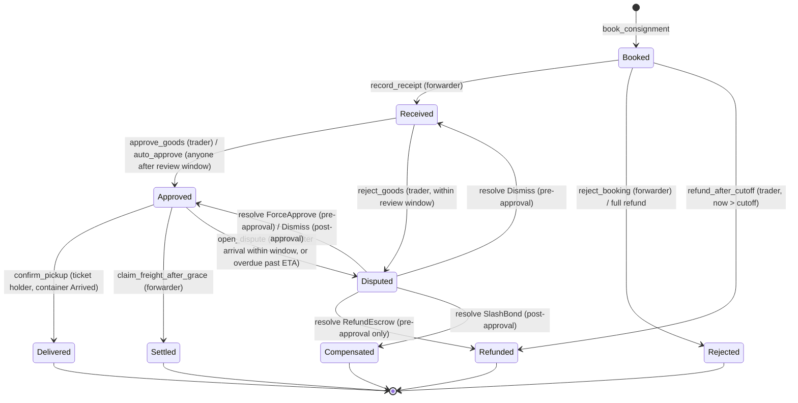

# MANIFEST — Master Build Prompt for Claude Code

> **How to use this file (for Greg):** create an empty folder called `manifest`, put this file inside it, open a terminal there, start Claude Code (`claude`), and say:
>
> _"Read MANIFEST_BUILD_PROMPT.md end to end. Then execute Phase 0 exactly as written and stop for my confirmation before Phase 1."_
>
> After that, run one phase per instruction: _"Execute Phase N."_ Claude Code keeps progress in `PROGRESS.md`, so you can close and reopen sessions safely.

---

## 0. Your role, mission and non-negotiables

You are the lead engineer building **Manifest**, a hackathon submission for the **Colosseum Crypto World's Fair Hackathon (Solana track)**. You are working with Greg, a solo founder in Nigeria. He is a backend engineer, strongest in **TypeScript / Next.js** and **PHP / Laravel**, and a professional illustrator and designer. He is less experienced in Rust, so explain non-obvious Rust and Anchor decisions in code comments and in your phase summaries.

**Mission:** ship a working, open-source, deployed-to-devnet product that lets small Nigerian importers pay Chinese suppliers through **pay-on-proof escrow**, ship in **shared containers** run by bonded freight forwarders, and receive a **transferable onchain Cargo Ticket** for their goods in transit.

**Non-negotiables:**

1. **Real onchain logic, no fakes.** Every state change the UI shows must come from the deployed Solana program. Never mock transactions or onchain state in the UI. Judges score "Functionality" by clicking through it.
2. **Tests before progress.** Do not start a new phase while program tests are failing.
3. **Current docs over memory.** Solana tooling changes fast. Before writing any Solana-specific code (Anchor constraints, Token-2022 extensions, client libraries, Actions/Blinks, Phantom SDK, Squads SDK), query the **Solana Developer MCP** and the installed skills. Do not guess APIs.
4. **No token launch.** Manifest has no governance token, no memecoin, no bonding curve. Do not integrate token-launch tooling.
5. **Devnet only.** Never touch mainnet funds. Never print, log or commit private keys or secrets. Every secret goes in `.env.local` (gitignored), and `.env.example` documents every variable.
6. **Never invent addresses.** Program IDs, mint addresses and multisig addresses come from config or env, or from a verified doc you cite in a code comment.
7. **Open source.** MIT license, public GitHub repo, clear README. "Open source and composability" is a judging criterion.
8. **The deadline is fixed.** Submissions close **Monday, October 12, 2026 at 11:59 PM Pacific**, which is **Tuesday, October 13 at 7:59 AM in Nigeria (WAT)**. Plan for code freeze at **Monday Oct 12, 6:00 PM WAT**. Today is Sunday, October 4, 2026.

---

## 1. Hackathon context and how it shapes the build

**The brief:** "Build a product that will drive the next wave of crypto startups that bring the world's markets onchain," built on Solana.

**Prizes relevant to us:**

- Solana track: $100,000 split across 10 projects ($10k each).
- Overall awards: $30k grand prize, plus $15k each for the next 20 projects.
- All winners are interviewed for Colosseum's accelerator ($250k pre-seed).
- Prizes are paid in Phantom's CASH stablecoin.

**The six judging criteria, and the build decision each one drives:**

| Criterion                    | What we must ship because of it                                                                                                                                                                                                                                                                      |
| ---------------------------- | ---------------------------------------------------------------------------------------------------------------------------------------------------------------------------------------------------------------------------------------------------------------------------------------------------- |
| Functionality / code quality | A clean Anchor program with exhaustive LiteSVM tests, a deployed devnet program, and a frontend whose every flow really works. Typed SDK, linted code, no dead code.                                                                                                                                 |
| Potential impact             | Pitch numbers in the README and pitch: China's exports to Nigeria hit a record $24.9B in 2025; China→Africa exports were $225B; Afreximbank estimates Africa's annual trade finance gap at $80–120B. The design generalizes to any corridor (UN/LOCODE ports, any stablecoin mint).                  |
| Novelty                      | Our wedge is not "escrow." It is three things together: a **forwarder bond**, **pay-on-proof-of-goods** at the consolidation warehouse, and **transferable Cargo Tickets** that make goods in transit tradable. Document this explicitly.                                                            |
| UX                           | Google/Apple login via Phantom embedded wallets (no seed phrases), mobile-first pages, plain-language copy, a shareable container link with a rich preview for WhatsApp, a Blink for X, and a devnet "try it" faucet so judges can test without setup.                                               |
| Open source / composability  | MIT license. The program is a reusable primitive. We compose with SPL Token, **Token-2022** (metadata pointer, token metadata, permanent delegate), **Squads** (arbitration multisig and treasury), **Solana Actions/Blinks**, and Phantom Connect, with an optional **Reflect** yield-bearing bond. |
| Business plan                | A protocol fee on escrowed value, a paid verified-forwarder tier, and in-transit inventory financing as the roadmap. Include `docs/BUSINESS.md`, a forwarder one-pager and an LOI template that Greg can take to real forwarders.                                                                    |

---

## 2. Product specification

### 2.1 The real-world problem

Small importers in Nigerian markets (phones and accessories in Computer Village, electronics in Alaba, textiles in Balogun, building materials, beauty products) cannot fill a whole container. Their typical process:

1. They buy from suppliers in Guangzhou or Yiwu, often via 1688 or the physical Yiwu market, through a China-based agent.
2. Their goods are delivered to a **consolidator / freight forwarder's warehouse** in China.
3. Goods ship by sea in a **shared container**, billed per **CBM** (cubic metre), or by air per kg.
4. They collect at the forwarder's Lagos warehouse after clearing at **Apapa** or **Tin Can** port.

Money moves **upfront and blind**. The trader buys USDT or hands naira to a "payment agent," pays the supplier or agent before anything is verified, then waits 45–60 days. The common failure modes are:

- the agent disappears with the money;
- the wrong goods or short quantities are shipped;
- cartons "go missing" from a shared container;
- goods are held hostage at the Lagos warehouse for surprise charges.

Big importers use bank **letters of credit (LCs)**. Micro-importers cannot get them. Trust is sold through WhatsApp testimonials that are easy to fake.

### 2.2 The solution in one sentence

Manifest is a **programmable letter of credit for shared-container importers**. Funds sit in onchain escrow and move only when the milestone they pay for is proven. Forwarders post a slashable bond before they can take bookings. Every consignment produces a transferable Cargo Ticket and feeds a public, unfakeable forwarder track record.

### 2.3 Actors

| Actor                   | Who they are in real life                                                         | What they do in Manifest                                                                                                                         |
| ----------------------- | --------------------------------------------------------------------------------- | ------------------------------------------------------------------------------------------------------------------------------------------------ |
| **Forwarder**           | A consolidator/freight company with a China warehouse and a Lagos warehouse       | Registers, posts a bond, opens containers, records goods received (photos + measured CBM), marks loaded/arrived, verifies pickups, earns freight |
| **Trader**              | The small importer                                                                | Books space, locks goods payment + freight in escrow, approves goods from photos, collects or sells the Cargo Ticket                             |
| **Payee**               | The supplier or the trader's China payment agent                                  | Receives the goods payment when the trader approves (no app needed, just a Solana address)                                                       |
| **Cargo Ticket holder** | The trader, or whoever they sold the goods-in-transit to                          | Picks up the goods in Lagos and holds the dispute rights                                                                                         |
| **Arbitrator**          | A Squads multisig (Manifest team + trusted market association reps in production) | Resolves disputes; can refund escrow or slash the forwarder bond                                                                                 |
| **Cranker**             | Anyone (we run a script/cron)                                                     | Calls permissionless timeout instructions (auto-approve, close booking)                                                                          |

### 2.4 End-to-end flow (the happy path)

1. **Forwarder onboarding.** Register (name) and deposit a USDC bond into a program-owned vault.
2. **Open a container.** Example: code `LAG-1014`, origin `CNCAN` (Guangzhou), destination `NGAPP` (Apapa), mode Sea, capacity 28 CBM, rate $380/CBM, booking cut-off date, ETA. The forwarder shares the container link on WhatsApp/X/Telegram.
3. **Trader books space.** Inputs: goods value, the supplier/agent's payout address, estimated CBM (with a calculator), and a short description. The trader locks **goods + protocol fee + estimated freight (with a 10% buffer)** in a per-consignment escrow vault. The forwarder's bond must cover a set percentage of all open goods value, or the booking is rejected.
4. **Goods arrive at the China warehouse.** The forwarder photographs the cartons and records measured CBM, carton count and packing list. The evidence bundle is stored off-chain and its **SHA-256 hash is written onchain**.
5. **Trader reviews and approves.** In one transaction: goods payment → payee, protocol fee → treasury, freight re-priced from measured CBM (excess refunded immediately; shortfall must be topped up before pickup), and a **Cargo Ticket** (Token-2022 NFT, supply 1) is minted to the trader.
   - If the trader is silent through the review window (72h; configurable to 2 minutes for demos), **anyone can auto-approve**.
   - If the goods are wrong, the trader rejects, which opens a dispute.
   - If goods never arrive by the cut-off, the trader **refunds themselves**.
6. **Optional resale.** The trader can transfer the Cargo Ticket to a buyer ("selling goods on the water"). Dispute and pickup rights follow the token.
7. **Loaded.** Once every active consignment is approved, the forwarder records the ISO 6346 container number and a hash of the bill of lading.
8. **Arrived.** The forwarder marks the container arrived in Lagos.
9. **Pickup.** At the warehouse the holder shows a QR code (a signed message proving they hold the ticket). The forwarder's dashboard verifies it, the forwarder hands over the cartons, and the holder taps "Confirm pickup." Freight releases to the forwarder, the ticket burns, and forwarder stats update.
   - If the holder never confirms, the forwarder can claim freight after the pickup grace period, as long as no dispute is open.
10. **Disputes after loading.** Missing or damaged cartons, or a container overdue past ETA, let the holder open a dispute. The arbitrator (Squads) can **slash the bond** to compensate the holder.

### 2.5 What is explicitly out of scope for the hackathon

- Naira on/off-ramps and FX conversion (traders already acquire USDT/USDC themselves; we only hold stablecoins).
- Customs, Form M, shipping-line or port API integrations.
- In-transit inventory financing (pitch it as the roadmap; do not build it).
- KYC/KYB. Show a "Verified forwarder" badge as an admin-set flag in the roadmap only.
- Native mobile apps. Build a mobile-first responsive web app, PWA-installable.

---

## 3. Tech stack and the resources to use

### 3.1 Stack decisions (pinned at Phase 0, recorded in `docs/DECISIONS.md`)

| Layer                    | Choice                                                                                                                                               | Notes                                                                                                                                                                                                                                                     |
| ------------------------ | ---------------------------------------------------------------------------------------------------------------------------------------------------- | --------------------------------------------------------------------------------------------------------------------------------------------------------------------------------------------------------------------------------------------------------- |
| Monorepo                 | **pnpm workspaces**                                                                                                                                  | `programs/`, `packages/sdk`, `app/`, `scripts/`, `tests/`                                                                                                                                                                                                 |
| Onchain                  | **Anchor** (latest stable 1.x at install time; record exact version)                                                                                 | Use `anchor_spl::token_interface` so the program works with both SPL Token (USDC/USDT) and Token-2022 (Cargo Tickets). Use `transfer_checked` everywhere.                                                                                                 |
| Program testing          | **LiteSVM** (fast, in-process, supports clock warping for deadlines)                                                                                 | Optional **Surfpool** integration run against devnet-forked state. Follow solana.com/docs/tools/litesvm.                                                                                                                                                  |
| TS client                | Anchor TS client matched to the installed Anchor major (`@anchor-lang/core` for 1.x, per the Colosseum resources page; `@coral-xyz/anchor` for 0.3x) | This keeps us on web3.js v1, which Phantom's React SDK examples and `@solana/actions` also use, so there is one client stack for the hackathon. Write a "Kit migration" note in `docs/DECISIONS.md` (Codama can generate Kit clients from the IDL later). |
| Frontend                 | **Next.js (App Router) + TypeScript + Tailwind**                                                                                                     | Mobile-first, PWA manifest, dynamic OG images via `next/og`                                                                                                                                                                                               |
| Wallets                  | **Phantom Connect React SDK** (`@phantom/react-sdk`, `@phantom/browser-sdk`) with providers `google`, `apple`, `injected`                            | Embedded wallets for non-crypto traders; injected Phantom for power users                                                                                                                                                                                 |
| Evidence storage         | Storage adapter: **Pinata/IPFS** when `PINATA_JWT` is set, local filesystem fallback for dev                                                         | The SHA-256 of a canonicalized JSON manifest goes onchain                                                                                                                                                                                                 |
| RPC                      | **Helius** devnet RPC (free tier)                                                                                                                    | Read state through `getProgramAccounts` with memcmp filters via the Anchor client                                                                                                                                                                         |
| Arbitration and treasury | **Squads v4** multisig (`@sqds/multisig`)                                                                                                            | `config.arbitrator` and `config.treasury_owner` are Squads vault PDAs on devnet                                                                                                                                                                           |
| Distribution             | **Solana Actions / Blinks** (`@solana/actions`), plus WhatsApp-friendly OG previews                                                                  | Blink for X; rich link preview for WhatsApp, where Blinks don't render                                                                                                                                                                                    |
| Hosting                  | **Vercel**                                                                                                                                           | Cron route for the crank                                                                                                                                                                                                                                  |

### 3.2 Hackathon-sponsor and ecosystem resources: what to use, where, and why

Install and consult these. The **Priority** column tells you what is required versus stretch.

| Resource                                  | Use it for                                                                                        | How to access                                                                                                                                                                                                                                                                                                                                                                                                                                           | Priority                      |
| ----------------------------------------- | ------------------------------------------------------------------------------------------------- | ------------------------------------------------------------------------------------------------------------------------------------------------------------------------------------------------------------------------------------------------------------------------------------------------------------------------------------------------------------------------------------------------------------------------------------------------------- | ----------------------------- |
| **Colosseum Resources skill**             | Curated Solana tooling and docs advice                                                            | `npx skills add ColosseumOrg/colosseum-resources` (reads `https://ColosseumOrg.github.io/hackathon-resources/current.json`)                                                                                                                                                                                                                                                                                                                             | Required (Phase 0)            |
| **Colosseum Copilot skill**               | Search past Colosseum hackathon projects to check novelty; write the competitive landscape doc    | `npx skills add ColosseumOrg/colosseum-copilot`; needs `COLOSSEUM_COPILOT_PAT` from `https://arena.colosseum.org/copilot` (Greg generates it)                                                                                                                                                                                                                                                                                                           | Required (Phase 0)            |
| **Solana Developer MCP**                  | Live Solana docs search, plus the Program Autofixer for Anchor code                               | `claude mcp add --transport http solana-mcp https://mcp.solana.com/mcp`, then `/mcp` to verify                                                                                                                                                                                                                                                                                                                                                          | Required                      |
| **Solana Agent Skills**                   | Official Solana skills (Kit, testing with LiteSVM/Mollusk/Surfpool)                               | Index at `https://solana.com/skills`; install the Foundation-maintained ones relevant to Anchor, testing, tokens and payments                                                                                                                                                                                                                                                                                                                           | Required                      |
| **Phantom Connect** (sponsor)             | Embedded wallets with Google/Apple login; injected Phantom                                        | Docs: `https://docs.phantom.com` (React SDK, Phantom Connect guide). Needs a Phantom Portal **App ID** with allowed domains and redirect URLs (Greg creates it). Optional starter: `npx -y create-solana-dapp@latest -t solana-foundation/templates/community/phantom-embedded-react` (inspect only; it declares no license, so don't copy wholesale). A community Phantom skill exists in `ColosseumOrg/hackathon-resources`; install it if available. | Required                      |
| **Squads** (sponsor via Altitude)         | Arbitrator multisig + protocol treasury                                                           | `https://squads.xyz/multisig`; SDK `@sqds/multisig` (v4, web3.js v1). Verify the v4 program ID on devnet from Squads docs before use. Mention **Altitude** (Squads' stablecoin operating account) in the business plan as the mainnet treasury and payments stack.                                                                                                                                                                                      | Required (script); UI stretch |
| **Reflect** (sponsor)                     | Let forwarders post their bond in Reflect's interest-bearing dollar so locked capital earns yield | `https://docs.reflect.money/`, `@reflectmoney/stable.ts` (pin the version). **First check whether a devnet mint exists.** If not, implement "allowed bond mints" in config and document the mainnet plan.                                                                                                                                                                                                                                               | Stretch                       |
| **Phantom CASH** (sponsor)                | Possible future payment/bond mint                                                                 | `https://docs.phantom.com/cash`; access and minting constraints apply. Roadmap mention only unless devnet access is trivial.                                                                                                                                                                                                                                                                                                                            | Roadmap                       |
| **Solana Actions & Blinks** + **Dialect** | "Book space on this container" Blink for X/Telegram                                               | `https://solana.com/docs/tools/actions`, `@solana/actions` (pin it), `https://docs.dialect.to/blinks`; test on `dial.to`                                                                                                                                                                                                                                                                                                                                | Required                      |
| **Token Extensions (Token-2022)**         | Cargo Ticket: MetadataPointer + TokenMetadata + PermanentDelegate                                 | `https://solana.com/docs/tokens/extensions`; reference implementations in `https://github.com/solana-foundation/program-examples` (token-2022 folder)                                                                                                                                                                                                                                                                                                   | Required                      |
| **Helius**                                | RPC; optional webhooks for notifications                                                          | Free plan                                                                                                                                                                                                                                                                                                                                                                                                                                               | Required (RPC)                |
| **Kora** (Solana Foundation fee relayer)  | Let users pay fees in USDC instead of SOL                                                         | `https://solana.com/docs/tools/kora/getting-started`. Requires running a Kora node, and the wallet must support sign-only. Investigate; use it only if Phantom embedded supports sign-only and setup takes under 2 hours. Otherwise use the devnet "gas tank" (section 7.5) and list Kora on the mainnet roadmap.                                                                                                                                       | Stretch                       |
| **Blueshift program security course**     | Security self-review checklist (signer, owner, PDA, CPI, init failure modes)                      | `https://learn.blueshift.gg`                                                                                                                                                                                                                                                                                                                                                                                                                            | Required (Phase 2 review)     |
| **Solana payments docs**                  | Subscriptions/allowances and payment-indexing patterns, for reference                             | `https://solana.com/docs/payments`                                                                                                                                                                                                                                                                                                                                                                                                                      | Reference                     |
| **create-solana-dapp**                    | Reference scaffold only                                                                           | `https://github.com/solana-foundation/create-solana-dapp`                                                                                                                                                                                                                                                                                                                                                                                               | Reference                     |
| **Circle devnet USDC**                    | Real devnet USDC for demos                                                                        | Faucet: `https://faucet.circle.com`; verify the devnet mint (commonly `4zMMC9srt5Ri5X14GAgXhaHii3GnPAEERYPJgZJDncDU`) before use                                                                                                                                                                                                                                                                                                                        | Required                      |
| **Stablecorp** (Colosseum perk)           | Company formation note in the business plan (Delaware C-Corp / Wyoming LLC, USDC banking)         | `https://mystablecorp.xyz`                                                                                                                                                                                                                                                                                                                                                                                                                              | Business plan mention         |

Do **not** integrate Meteora DBC, Raydium launch tooling, Arcium, or x402 agent payments. They don't serve this product, and forced integrations hurt the "novelty" and "UX" scores. You may mention confidential transfers (Token-2022) and Arcium in the roadmap as **privacy for order values**: traders don't want competitors in the same market seeing their import sizes.

---

## 4. Phase 0: environment, tooling and scaffold (Sunday Oct 4, ~3 hours)

### 4.1 Verify the toolchain

Check and record versions in `docs/DECISIONS.md`. Install whatever is missing, following the current official install guide (`https://solana.com/docs/intro/installation`). Confirm via Solana MCP that versions are compatible.

- Rust (stable), Solana CLI (Agave), Anchor CLI (via `avm`), Node.js LTS, pnpm.
- `solana config set --url devnet`
- Create a **dedicated dev keypair** for deploys at `~/.config/solana/manifest-dev.json` (never inside the repo).
- Ask Greg to fund it with devnet SOL (`https://faucet.solana.com`). Budget ~5 devnet SOL for deploys and upgrades.

### 4.2 Connect AI tooling

```bash
claude mcp add --transport http solana-mcp https://mcp.solana.com/mcp
npx skills add ColosseumOrg/colosseum-resources
npx skills add ColosseumOrg/colosseum-copilot
# Plus the relevant Foundation skills listed at https://solana.com/skills
```

Run `/mcp` to confirm `solana-mcp` is connected. If `COLOSSEUM_COPILOT_PAT` is not set, ask Greg to generate it at `https://arena.colosseum.org/copilot` and `export` it. Do not proceed with the Copilot step without it.

### 4.3 Novelty check (Colosseum Copilot)

Search past Colosseum submissions for: "letter of credit", "trade finance", "escrow import", "freight", "shipping", "bill of lading", "cargo", "Nigeria import", "Africa trade", "supply chain escrow". Write `docs/COMPETITIVE_LANDSCAPE.md` with:

- the closest 5–10 past projects (name, hackathon, one-line summary, how Manifest differs);
- off-chain competitors (Alibaba Trade Assurance covers Alibaba.com orders only; bank LCs; informal payment agents; fintech FX payment providers);
- a three-sentence "Why Manifest is different" statement for the README.

If Copilot finds a near-identical project, **stop and tell Greg** before Phase 1 so he can sharpen the wedge.

### 4.4 Repository scaffold

```
manifest/
├── CLAUDE.md                 # Project rules for future Claude Code sessions (see 4.5)
├── PROGRESS.md               # Living checklist: done / in progress / next / blockers
├── README.md
├── LICENSE                   # MIT, copyright "2026 Emediong Etuk Gregory"
├── .env.example
├── .gitignore                # node_modules, target, .env*, .anchor, keypairs, .data
├── Anchor.toml
├── Cargo.toml                # workspace
├── pnpm-workspace.yaml
├── programs/manifest/src/
│   ├── lib.rs
│   ├── constants.rs
│   ├── errors.rs
│   ├── events.rs
│   ├── state/{config.rs, forwarder.rs, container.rs, consignment.rs, mod.rs}
│   ├── instructions/{admin/*, forwarder/*, trader/*, permissionless/*, arbitrator/*, mod.rs}
│   └── utils/{math.rs, token.rs, cargo_ticket.rs, mod.rs}
├── tests/                    # LiteSVM tests (Rust or TS; choose one, document it)
├── packages/sdk/src/{index.ts, pdas.ts, accounts.ts, instructions.ts, status.ts, format.ts, errors.ts, constants.ts, types.ts}
├── app/                      # Next.js
├── scripts/                  # init, mints, seed, crank, squads, faucet
└── docs/{DECISIONS.md, ARCHITECTURE.md, SECURITY.md, COMPETITIVE_LANDSCAPE.md, BUSINESS.md,
          DEMO_SCRIPT.md, PITCH_SCRIPT.md, SUBMISSION_CHECKLIST.md, SETUP_CHECKLIST.md,
          FORWARDER_ONEPAGER.md, LOI_TEMPLATE.md}
```

Initialize git, make the first commit, and ask Greg to create a **public** GitHub repo named `manifest` and add the remote.

### 4.5 Write `CLAUDE.md` (persistent project memory for every future session)

It must include:

- a one-paragraph product summary;
- the deadline (Oct 12 11:59 PM PT = Oct 13 7:59 AM WAT) and the code freeze (Oct 12, 6 PM WAT);
- the non-negotiables from section 0;
- build/test/deploy commands;
- a pointer to `PROGRESS.md` and this file;
- the house rules from section 15;
- the glossary from the appendix.

### 4.6 Phase 0 done when

- [ ] All tools are installed, versions recorded, Solana MCP connected, skills installed.
- [ ] `COMPETITIVE_LANDSCAPE.md` is written, or Copilot is blocked pending Greg's PAT (recorded in PROGRESS).
- [ ] The scaffold is committed, `anchor build` succeeds on an empty program, and `pnpm -r build` succeeds.
- [ ] `docs/SETUP_CHECKLIST.md` lists every human-only task from section 16.
- [ ] Stop and summarize for Greg.

---

## 5. Onchain program specification (`programs/manifest`)

### 5.1 Conventions

- **Amounts:** `u64` in token base units. All accepted payment and bond mints **must have 6 decimals**; enforce this at config time. Coverage math assumes USD-pegged stablecoins at ~1:1; document this assumption in SECURITY.md.
- **Volumes:** store CBM as **milli-CBM** in `u32` (1.250 CBM = `1250`).
- **Freight:** `ceil(measured_cbm_milli × rate_per_cbm / 1000)`, computed in `u128` and checked back into `u64`.
- **Basis points:** `u16`, max 10_000.
- **Time:** `i64` unix seconds from the `Clock` sysvar only.
- **Strings:** fixed byte arrays, UTF-8, zero-padded, so account sizes stay fixed. The SDK provides encode/decode helpers.
- **Port codes:** UN/LOCODE as `[u8; 5]` (e.g. `CNCAN` Guangzhou, `CNYIW` Yiwu, `CNSZX` Shenzhen, `NGAPP` Apapa, `NGTIN` Tin Can, `NGLOS` Lagos air).
- **Math:** checked arithmetic everywhere; never `as` casts that can truncate silently.
- **Version field:** every account starts with `version: u8 = 1`, followed by its `bump`.
- **Events:** emit an Anchor event on every state transition.
- **Errors:** a custom `ManifestError` enum with human-readable messages. The SDK maps codes to friendly UI strings.

### 5.2 Accounts and PDAs

#### `Config` — seeds `["config"]` (singleton)

| Field               | Type        | Notes                                                                                |
| ------------------- | ----------- | ------------------------------------------------------------------------------------ |
| version, bump       | u8, u8      |                                                                                      |
| admin               | Pubkey      | Can update config and pause                                                          |
| arbitrator          | Pubkey      | Squads vault PDA on devnet                                                           |
| treasury_owner      | Pubkey      | Owner of fee ATAs (Squads vault PDA)                                                 |
| payment_mints       | [Pubkey; 4] | Allowed escrow mints (USDC, USDT, test mint); `Pubkey::default()` = empty slot       |
| bond_mints          | [Pubkey; 4] | Allowed bond mints (USDC, test mint, Reflect stable later)                           |
| fee_bps             | u16         | Default 75 (0.75%)                                                                   |
| coverage_bps        | u16         | Default 2000 (bond must cover 20% of open goods value)                               |
| freight_buffer_bps  | u16         | Default 1000 (10% extra freight escrowed at booking)                                 |
| review_window_secs  | i64         | Default 259_200 (72h); demo 120                                                      |
| pickup_grace_secs   | i64         | Default 1_209_600 (14d); demo 300                                                    |
| dispute_window_secs | i64         | Default 604_800 (7d after arrival); demo 600                                         |
| overdue_grace_secs  | i64         | Default 2_592_000 (30d past ETA); demo 600                                           |
| on_time_grace_secs  | i64         | Default 604_800 (arrival within ETA + 7d counts as on time)                          |
| metadata_base_uri   | [u8; 96]    | e.g. `https://manifest.app/api/tickets/`; the program appends the consignment pubkey |
| paused              | bool        | Blocks new containers and bookings, never refunds or claims                          |

#### `Forwarder` — seeds `["forwarder", authority]`

| Field                        | Type     | Notes                                                                    |
| ---------------------------- | -------- | ------------------------------------------------------------------------ |
| authority                    | Pubkey   | Forwarder's wallet                                                       |
| name                         | [u8; 32] | Display name                                                             |
| bond_mint                    | Pubkey   | Chosen at registration; must be in `config.bond_mints`                   |
| bond_vault                   | Pubkey   | Token account PDA `["bond_vault", forwarder]`, authority = forwarder PDA |
| bond_balance                 | u64      | Mirrors the vault; assert they agree in tests                            |
| locked_coverage              | u64      | Sum of coverage currently locked by open consignments                    |
| container_count              | u32      | Next container index                                                     |
| stats_consignments_delivered | u32      |                                                                          |
| stats_on_time                | u32      |                                                                          |
| stats_disputes_opened        | u32      |                                                                          |
| stats_disputes_lost          | u32      | Disputes resolved with a slash                                           |
| stats_volume                 | u64      | Total goods value delivered                                              |
| stats_slashed_total          | u64      |                                                                          |
| created_at                   | i64      |                                                                          |

#### `Container` — seeds `["container", forwarder, index_le_bytes(u32)]`

| Field                 | Type                                                                 | Notes                                                                                           |
| --------------------- | -------------------------------------------------------------------- | ----------------------------------------------------------------------------------------------- |
| forwarder             | Pubkey                                                               | Forwarder PDA                                                                                   |
| index                 | u32                                                                  |                                                                                                 |
| code                  | [u8; 12]                                                             | Human code, e.g. `LAG-1014`                                                                     |
| origin, destination   | [u8; 5], [u8; 5]                                                     | UN/LOCODE                                                                                       |
| mode                  | enum `Sea \| Air`                                                    | Air uses kg in the UI but stores "milli-units" the same way (document; Sea is the demo default) |
| mint                  | Pubkey                                                               | Payment mint for all consignments in this container                                             |
| capacity_cbm_milli    | u32                                                                  |                                                                                                 |
| booked_cbm_milli      | u32                                                                  | Sum of estimates for active bookings                                                            |
| received_cbm_milli    | u32                                                                  | Sum of measured CBM                                                                             |
| rate_per_cbm          | u64                                                                  | Base units per 1 CBM                                                                            |
| cutoff_ts             | i64                                                                  | Bookings close and goods must reach the warehouse by this time                                  |
| eta_ts                | i64                                                                  | Expected arrival at destination                                                                 |
| status                | enum `Open \| Closed \| Loaded \| Arrived \| Completed \| Cancelled` |                                                                                                 |
| container_number      | [u8; 11]                                                             | ISO 6346 (4 letters + 7 digits), set at loading; validate the format                            |
| bl_hash               | [u8; 32]                                                             | SHA-256 of the bill-of-lading document                                                          |
| loaded_ts, arrived_ts | i64                                                                  |                                                                                                 |
| consignment_count     | u16                                                                  | Next consignment index                                                                          |
| active_count          | u16                                                                  | Booked, not refunded or rejected                                                                |
| approved_count        | u16                                                                  |                                                                                                 |
| settled_count         | u16                                                                  | Delivered, settled or compensated                                                               |

#### `Consignment` — seeds `["consignment", container, index_le_bytes(u16)]`

| Field                                           | Type         | Notes                                                                                     |
| ----------------------------------------------- | ------------ | ----------------------------------------------------------------------------------------- |
| container                                       | Pubkey       |                                                                                           |
| index                                           | u16          |                                                                                           |
| trader                                          | Pubkey       | Original booker                                                                           |
| payee                                           | Pubkey       | Supplier/agent wallet that receives the goods payment                                     |
| mint                                            | Pubkey       | Equals `container.mint`                                                                   |
| vault                                           | Pubkey       | Token account PDA `["vault", consignment]`, authority = consignment PDA                   |
| goods_amount                                    | u64          |                                                                                           |
| fee_amount                                      | u64          | `goods_amount × fee_bps / 10_000` (round down, in the user's favor)                       |
| freight_escrowed                                | u64          | Currently held for freight                                                                |
| freight_due                                     | u64          | Set at approval from measured CBM                                                         |
| est_cbm_milli                                   | u32          |                                                                                           |
| measured_cbm_milli                              | u32          |                                                                                           |
| carton_count                                    | u16          |                                                                                           |
| description                                     | [u8; 64]     | Short, e.g. "Phone cases, 12 cartons"                                                     |
| evidence_hash                                   | [u8; 32]     | SHA-256 of the canonical evidence manifest                                                |
| coverage_locked                                 | u64          | `goods_amount × coverage_bps / 10_000` (round up)                                         |
| status                                          | enum (below) |                                                                                           |
| prev_status                                     | enum         | Used by `Dismiss` resolutions                                                             |
| dispute_reason                                  | u8           | 0 none, 1 wrong goods, 2 short quantity, 3 missing cartons, 4 damaged, 5 overdue, 6 other |
| cargo_ticket_mint                               | Pubkey       | `Pubkey::default()` until approval                                                        |
| booked_at, received_at, approved_at, settled_at | i64          |                                                                                           |
| review_deadline                                 | i64          | `received_at + review_window_secs`                                                        |

**Consignment status enum:** `Booked, Received, Approved, Disputed, Refunded, Rejected, Delivered, Settled, Compensated`.

The UI derives display stages ("Loaded", "Sailing", "Arrived") from `container.status` while the consignment is `Approved`. **Do not iterate consignments onchain**; container counters make this possible.

#### Program-owned token accounts and mints

- `["vault", consignment]`: escrow for goods, fee and freight, in `container.mint`.
- `["bond_vault", forwarder]`: bond, in `forwarder.bond_mint`.
- `["cargo_ticket", consignment]`: Token-2022 mint with decimals 0 and extensions **MetadataPointer** (pointing to itself), **TokenMetadata** (name `Manifest Cargo Ticket <CODE>-<INDEX>`, symbol `MCT`, uri = `metadata_base_uri + consignment pubkey (base58)`), and **PermanentDelegate** = a program PDA `["ticket_authority"]`. The permanent delegate lets the program burn the ticket on forwarder settlement or slash resolution without the holder signing. **Explain this in the UI tooltip and SECURITY.md.** Mint exactly 1 to the trader's Token-2022 ATA, then set mint authority to `None`. Follow the official Token-2022 Anchor examples (metadata init needs extra lamports and a realloc; verify via Solana MCP and `program-examples`).

### 5.3 State machines



Container: `Open → Closed` (cut-off passes, via forwarder or permissionless `close_booking`) `→ Loaded` (only when `approved_count == active_count && active_count > 0`) `→ Arrived → Completed` (when `settled_count == active_count`). `Open/Closed → Cancelled` is allowed only when `active_count == 0`.

### 5.4 Instructions

For every instruction, implement: signer checks, `has_one` / seeds / owner constraints, mint checks against config and container, status checks, time checks, checked math, token CPIs via `transfer_checked` with PDA signer seeds, counter and stat updates, and an event.

**Admin**

| Instruction                 | Signer           | Effect                                                                  |
| --------------------------- | ---------------- | ----------------------------------------------------------------------- |
| `initialize_config(params)` | admin (deployer) | Creates Config; validates mint decimals == 6, bps ≤ 10_000, windows > 0 |
| `update_config(params)`     | admin            | Updates any field except admin; can set `paused`                        |
| `transfer_admin(new_admin)` | admin            |                                                                         |

**Forwarder**

| Instruction                                                                                                  | Signer                                    | Checks                                                                                                       | Effect                                                                                                                                                                                                            |
| ------------------------------------------------------------------------------------------------------------ | ----------------------------------------- | ------------------------------------------------------------------------------------------------------------ | ----------------------------------------------------------------------------------------------------------------------------------------------------------------------------------------------------------------- |
| `register_forwarder(name, bond_mint)`                                                                        | authority                                 | bond_mint allowed                                                                                            | Creates Forwarder + bond vault                                                                                                                                                                                    |
| `deposit_bond(amount)`                                                                                       | authority                                 | amount > 0                                                                                                   | Transfer into bond vault; `bond_balance += amount`                                                                                                                                                                |
| `withdraw_bond(amount)`                                                                                      | authority                                 | `bond_balance - amount ≥ locked_coverage`                                                                    | Transfer out                                                                                                                                                                                                      |
| `open_container(code, origin, destination, mode, mint, capacity_cbm_milli, rate_per_cbm, cutoff_ts, eta_ts)` | authority                                 | not paused; mint allowed; `now < cutoff_ts < eta_ts`; capacity > 0; rate > 0                                 | Creates Container (index = `container_count++`)                                                                                                                                                                   |
| `close_booking()`                                                                                            | authority, or anyone if `now ≥ cutoff_ts` | status Open                                                                                                  | Status → Closed                                                                                                                                                                                                   |
| `cancel_container()`                                                                                         | authority                                 | `active_count == 0`; status Open/Closed                                                                      | Status → Cancelled                                                                                                                                                                                                |
| `reject_booking()`                                                                                           | authority                                 | consignment Booked                                                                                           | Refund goods + fee + freight to trader; release coverage; `active_count--`; `booked_cbm` −= estimate; status Rejected                                                                                             |
| `record_receipt(evidence_hash, measured_cbm_milli, carton_count)`                                            | authority                                 | consignment Booked; container Open/Closed; `received_cbm + measured ≤ capacity`                              | Store evidence; `received_at = now`; `review_deadline = now + review_window`; status Received                                                                                                                     |
| `mark_loaded(container_number, bl_hash)`                                                                     | authority                                 | container Closed; `approved_count == active_count > 0`; ISO 6346 format                                      | Status Loaded; `loaded_ts`                                                                                                                                                                                        |
| `mark_arrived()`                                                                                             | authority                                 | container Loaded                                                                                             | Status Arrived; `arrived_ts`                                                                                                                                                                                      |
| `claim_freight_after_grace()`                                                                                | authority                                 | container Arrived; consignment Approved; `now > arrived_ts + pickup_grace`; `freight_escrowed ≥ freight_due` | Freight → forwarder ATA; any excess → trader; burn ticket via permanent delegate (pass the holder's token account; read the holder from it); release coverage; status Settled; `settled_count++`; maybe Completed |

**Trader / ticket holder**

| Instruction                                                         | Signer                                                                                   | Checks                                                                                                                                                                                                  | Effect                                                                                                                                                                                                                                                         |
| ------------------------------------------------------------------- | ---------------------------------------------------------------------------------------- | ------------------------------------------------------------------------------------------------------------------------------------------------------------------------------------------------------- | -------------------------------------------------------------------------------------------------------------------------------------------------------------------------------------------------------------------------------------------------------------- |
| `book_consignment(goods_amount, est_cbm_milli, payee, description)` | trader (payer)                                                                           | not paused; container Open; `now < cutoff`; `booked_cbm + est ≤ capacity`; goods > 0; payee ≠ default and ≠ vault; **coverage**: `forwarder.locked_coverage + coverage_needed ≤ forwarder.bond_balance` | Creates Consignment + vault; transfers `goods + fee + ceil(est_freight × (1 + buffer))` from the trader; locks coverage; `active_count++`; `booked_cbm += est`                                                                                                 |
| `refund_after_cutoff()`                                             | trader                                                                                   | consignment Booked; `now > container.cutoff_ts`                                                                                                                                                         | Full refund; release coverage; `active_count--`; status Refunded                                                                                                                                                                                               |
| `approve_goods()`                                                   | trader                                                                                   | consignment Received; `now ≤ review_deadline` (after it, only `auto_approve`)                                                                                                                           | See **approval settlement** below                                                                                                                                                                                                                              |
| `reject_goods(reason)`                                              | trader                                                                                   | consignment Received; `now ≤ review_deadline`                                                                                                                                                           | `prev_status = Received`; status Disputed; `forwarder.stats_disputes_opened++`                                                                                                                                                                                 |
| `top_up_freight(amount)`                                            | trader or holder                                                                         | consignment Approved; `freight_escrowed < freight_due`                                                                                                                                                  | Transfer into vault                                                                                                                                                                                                                                            |
| `confirm_pickup()`                                                  | **current Cargo Ticket holder** (prove by passing their Token-2022 ATA with amount == 1) | container Arrived; consignment Approved; `freight_escrowed ≥ freight_due`                                                                                                                               | Freight due → forwarder ATA; excess → holder; holder burns the ticket (holder signs the burn); release coverage; stats: delivered++, on_time++ if `arrived_ts ≤ eta_ts + on_time_grace`, volume += goods; status Delivered; `settled_count++`; maybe Completed |
| `open_dispute(reason)`                                              | current ticket holder                                                                    | consignment Approved AND either (container Arrived and `now ≤ arrived_ts + dispute_window`) or (container not Arrived and `now > eta_ts + overdue_grace`)                                               | `prev_status = Approved`; status Disputed; stats_disputes_opened++                                                                                                                                                                                             |

**Approval settlement** (shared by `approve_goods` and `auto_approve`, in one function):

1. Transfer `goods_amount` from vault → payee ATA (create with `init_if_needed`, payer = signer).
2. Transfer `fee_amount` → treasury ATA (owner = `config.treasury_owner`; create if needed).
3. Compute `freight_due` from `measured_cbm_milli`. If `freight_escrowed > freight_due`, refund the difference to the trader immediately and set `freight_escrowed = freight_due`.
4. Create the Cargo Ticket mint and the trader's Token-2022 ATA, mint 1, and revoke mint authority.
5. `approved_count++`; `approved_at = now`; status Approved.

Add a compute-budget instruction client-side (up to 400k CU) and measure the real CU usage in tests. If a single transaction is too heavy, **split ticket minting into a separate permissionless `mint_cargo_ticket` instruction** that is required before pickup or transfer, and document the decision.

**Permissionless**

| Instruction      | Checks                                        | Effect                                                                              |
| ---------------- | --------------------------------------------- | ----------------------------------------------------------------------------------- |
| `auto_approve()` | consignment Received; `now > review_deadline` | Approval settlement; the ticket goes to `consignment.trader`; the cranker pays rent |

**Arbitrator**

| Instruction                   | Signer                                                   | Effect                                                                                                                                                                                                                                                                                                                                                                                                                                                                                                                                                                                                                         |
| ----------------------------- | -------------------------------------------------------- | ------------------------------------------------------------------------------------------------------------------------------------------------------------------------------------------------------------------------------------------------------------------------------------------------------------------------------------------------------------------------------------------------------------------------------------------------------------------------------------------------------------------------------------------------------------------------------------------------------------------------------ |
| `resolve_dispute(resolution)` | `config.arbitrator` (Squads vault via vault transaction) | `RefundEscrow` (only if `prev_status == Received`): refund all escrow to the trader, release coverage, `active_count--`, status Refunded. `ForceApprove` (only if `prev_status == Received`): run approval settlement. `Dismiss`: status = `prev_status`. `SlashBond { amount }` (only if `prev_status == Approved`): transfer `min(amount, goods_amount, bond_balance)` from the bond vault → holder ATA (bond mint), refund remaining freight escrow to the holder, burn the ticket via permanent delegate, release coverage, `stats_disputes_lost++`, `stats_slashed_total += paid`, status Compensated, `settled_count++`. |

**Note on payee ATA rent and SOL:** the signer pays rent for any ATAs created. Devnet UX handles this with the gas tank (section 7.5).

### 5.5 Events

Emit `ConfigUpdated`, `ForwarderRegistered`, `BondDeposited`, `BondWithdrawn`, `ContainerOpened`, `BookingClosed`, `ContainerCancelled`, `ConsignmentBooked`, `BookingRejected`, `ReceiptRecorded`, `GoodsApproved { auto: bool }`, `GoodsRejected`, `FreightToppedUp`, `CargoTicketMinted`, `ContainerLoaded`, `ContainerArrived`, `PickupConfirmed`, `FreightClaimed`, `DisputeOpened`, `DisputeResolved { resolution, amount }`, `Refunded`. Include the relevant pubkeys, amounts and timestamps in each.

### 5.6 Security invariants (assert in tests, list in `docs/SECURITY.md`)

1. Only the vault's PDA authority can move escrow; only the forwarder PDA can move the bond.
2. For every consignment, vault balance == amount the state says is held at that stage (goods + fee + freight before approval; freight only after).
3. `bond_balance ≥ locked_coverage` after every instruction, **except** after a slash, where locked coverage is released first.
4. Status transitions happen only along the edges in 5.3. Every handler starts with `require!(status == X)`.
5. Mints are validated: the escrow mint equals the container mint and is in config; the bond mint is in config; token program IDs come from the Interface type.
6. The Cargo Ticket has supply exactly 1, decimals 0 and no mint authority after minting. Pickup and disputes require holding it.
7. No reinitialization (`init` only, never `init_if_needed` for program state; `init_if_needed` only for ATAs).
8. All time comparisons use Clock; deadlines can't be set in the past.
9. No account closures for Consignment/Container/Forwarder (history = reputation). Document the rent cost as a known trade-off.
10. Arithmetic overflow and underflow are impossible (checked ops) and tested at boundary values.

### 5.7 Program tests (LiteSVM) — the required matrix

Write helpers for: deploying the program, creating a 6-decimal test mint, funding wallets, warping the clock, and fetching and decoding accounts. Every test name states the behavior.

**Happy paths**

- Full lifecycle: register → bond → open → book (3 traders) → receipts → approve (one manual, one auto) → close → load → arrive → pickup ×3 → container Completed. Assert all balances and stats at each step.
- Cargo Ticket transfer: trader A transfers to buyer B; B confirms pickup; A can no longer act.
- Freight re-pricing: measured < estimate refunds the excess at approval; measured > estimate requires a top-up before pickup succeeds.
- Forwarder freight claim after grace burns the ticket and settles.

**Refunds and rejections**

- Trader refund after cut-off with no receipt.
- Forwarder `reject_booking` refunds in full.
- Pre-approval dispute resolved as `RefundEscrow` and as `ForceApprove`.

**Disputes and slashing**

- Post-arrival dispute resolved with `SlashBond`: the holder is paid in the bond mint, the ticket burns, stats update.
- Overdue dispute (container never arrives, ETA + grace passes).
- `Dismiss` returns to the previous status.

**Must-fail cases** (assert the specific error)

- Booking when paused; after cut-off; beyond capacity; beyond bond coverage; with a non-allowed mint; with goods = 0.
- Approve by a non-trader; approve before receipt; approve after the review deadline (manual); auto-approve before the deadline.
- `record_receipt` by a non-forwarder; on the wrong status; exceeding capacity.
- `mark_loaded` with unapproved consignments; invalid ISO 6346 number.
- Pickup before arrival; pickup by a non-holder; pickup with insufficient freight.
- Bond withdrawal below locked coverage.
- `resolve_dispute` by a non-arbitrator; `RefundEscrow` on a post-approval dispute.
- `claim_freight_after_grace` before grace or while disputed.
- Double approval; double pickup.
- Overflow: max u64 goods amount rejected cleanly.

Also log the compute units of `approve_goods` and `book_consignment` in a test and record them in DECISIONS.md.

### 5.8 Security pass (end of Phase 2)

- Run the Solana MCP **Program Autofixer** on every Rust file and review each suggestion (don't apply blindly).
- Walk through the Blueshift program-security checklist (signer, owner, PDA, CPI, init, arbitrary-account substitution, type cosplay, duplicate mutable accounts).
- Write the threat model in `docs/SECURITY.md`:
  - forwarder fraud (lying receipt → mitigated by trader approval + bond);
  - trader griefing (silence → auto-approve);
  - arbitrator compromise (multisig; roadmap: a timelock);
  - evidence tampering (hash onchain);
  - permanent-delegate trust (program-only PDA, used only in two documented paths);
  - stablecoin peg assumption.

---

## 6. TypeScript SDK (`packages/sdk`)

The single source of truth for the app, scripts and TS tests. Nothing else builds instructions by hand.

- **`pdas.ts`**: derive every PDA from section 5.2 (config, forwarder, container, consignment, vault, bond_vault, cargo_ticket, ticket_authority).
- **`accounts.ts`**: typed fetchers.
  - `getConfig`, `getForwarder(authority)`, `getForwarderByPda`.
  - `listContainers({ status?, forwarder? })` and `listConsignments({ container?, trader?, status? })`, using memcmp filters on the discriminator + field offsets. Compute offsets from the IDL; do not hand-count bytes.
  - `findCargoTicketHolder(consignment)`: `getTokenLargestAccounts` on the ticket mint, returning the owner of the account with amount 1.
- **`instructions.ts`**: one async builder per instruction, returning `TransactionInstruction[]`. It includes ATA-creation instructions where needed and an optional compute-budget instruction. Also `buildTx(ixs, payer)`, which returns a `VersionedTransaction` with a recent blockhash.
- **`status.ts`**: `deriveStage(consignment, container, now)` returns one of `AWAITING_GOODS`, `REVIEW_PHOTOS`, `PAID_SUPPLIER`, `LOADED`, `SAILING`, `ARRIVED_READY_FOR_PICKUP`, `COLLECTED`, `REFUNDED`, `IN_DISPUTE`, `COMPENSATED`, `SETTLED`. Also `allowedActions(role, consignment, container, now)` returns the buttons the UI should show. Unit-test both exhaustively with Vitest.
- **`format.ts`**:
  - base units ↔ display (`$1,234.56`); milli-CBM ↔ `1.25 CBM`;
  - fixed-byte string encode/decode; UN/LOCODE → city name map;
  - ISO 6346 validation (including the check digit, client-side);
  - countdown formatting.
- **`errors.ts`**: map Anchor error codes → plain-English messages (e.g. `CoverageExceeded` → "This forwarder's bond is fully used. Try another container or ask them to top up their bond.").
- **`evidence.ts`**: canonical JSON (RFC 8785 via the `canonicalize` package) + SHA-256 (WebCrypto in the browser, `crypto` in Node). The same function runs in both. Include `verifyEvidence(manifestJson, onchainHash)`.
- **`constants.ts`**: the program ID from env/IDL, mints from env, and cluster.

Publish the generated IDL and types from the Anchor build into the SDK at build time (a script copies `target/idl` and `target/types`).

---

## 7. Off-chain services (Next.js route handlers in `app/`)

Keep the backend thin: the chain is the database. There is no SQL database in the MVP. If you need small persistent state (gas-tank rate limiting, notification prefs), use Vercel KV/Upstash when its env vars exist, and fall back to in-memory with a clear warning.

### 7.1 Evidence pipeline

**`POST /api/evidence`** (multipart):

- **Fields:** consignment pubkey, measuredCbmMilli, cartonCount, packingList (JSON array of `{item, qty}`), notes, photos (1–8 images).
- **Auth:** the forwarder signs the message `manifest-evidence:<consignment>:<sha256 of fields>:<unix ts>` with their wallet (`signMessage`, which Phantom supports). The server verifies the ed25519 signature (`tweetnacl`). It loads the consignment → container → forwarder onchain and checks the signer is `forwarder.authority` and the consignment status is Booked. It rejects timestamps older than 5 minutes.
- **Processing:** strip EXIF and resize to max 1600px (`sharp`), compute each photo's SHA-256, upload via the storage adapter, and build the manifest:

  ```json
  {
    "schema": "manifest.evidence.v1",
    "consignment": "<pubkey>",
    "container": "<pubkey>",
    "forwarder": "<pubkey>",
    "recordedAt": "2026-10-09T10:15:00Z",
    "measuredCbmMilli": 1250,
    "cartonCount": 12,
    "packingList": [{ "item": "iPhone 15 silicone cases", "qty": 2400 }],
    "notes": "2 cartons slightly dented, contents fine",
    "photos": [{ "uri": "ipfs://...", "sha256": "<hex>", "width": 1600, "height": 1200 }]
  }
  ```

  Canonicalize it, hash it, upload the manifest itself, and return `{ manifestUri, manifestHashHex }`. The client then sends the `record_receipt` transaction with that hash.

- Client-side, compress images **before upload** (`browser-image-compression`), because forwarders upload over mobile data.

**`GET /api/evidence/[consignment]`** returns the manifest by looking up the latest manifest for that consignment. Store an index file per consignment in storage. The UI recomputes the hash in the browser and shows **"Verified: matches the record on Solana"** or a red warning.

### 7.2 Cargo Ticket metadata

- `GET /api/tickets/[consignment]` returns Metaplex-style JSON metadata: name, symbol, description, `image` → `/api/tickets/[consignment]/image`, and attributes (container code, route, mode, cartons, measured CBM, status, explorer link). **Do not include goods value** (privacy).
- `GET /api/tickets/[consignment]/image` is a dynamic `next/og` image designed like a physical cargo ticket / boarding pass: route with port codes, container code in a stencil font, carton count, a QR to the public verify page, and a "VOID" stamp if settled.

### 7.3 Container share previews

`GET /api/og/container/[pubkey]` is a dynamic OG image showing the route (`GUANGZHOU → APAPA`), CBM left with a progress bar, the rate, the cut-off countdown, the forwarder name and score, and a bond-coverage badge. The container page sets `og:image` to it, so **WhatsApp link previews look great**. WhatsApp is where traders live; Blinks don't render there.

### 7.4 Solana Actions / Blinks

- `GET /actions.json` maps `/c/*` → `/api/actions/book/*`.
- `GET /api/actions/book/[container]` returns an `ActionGetResponse`:
  - icon = the OG image;
  - title "Book space on LAG-1014: Guangzhou → Apapa";
  - description with CBM left, rate, cut-off and forwarder score;
  - one action with parameters: goods value (USD), estimated CBM, payee address, description.
- `POST /api/actions/book/[container]` validates the params with zod and builds the `book_consignment` transaction for `account` (including ATA creation if needed). It returns `{ type: "transaction", transaction, message }`.
- Use `createActionHeaders` from `@solana/actions` with the devnet chain ID on **every** response, including OPTIONS (CORS).
- Test on `https://dial.to` with `cluster=devnet`. Document the Dialect registry step for X unfurling as a human task.

### 7.5 Devnet "try it" faucet and gas tank (critical for judges)

**`POST /api/faucet`** `{ address }`:

- Active only when `NEXT_PUBLIC_CLUSTER=devnet`.
- If the wallet has < 0.02 SOL, send 0.05 devnet SOL.
- Also mint **500 test dollars** of the demo mint (we hold its mint authority on devnet).
- Rate-limit: once per address per 24h, plus a global daily cap.
- Uses `GAS_TANK_SECRET_KEY` (a funded devnet keypair stored only in env).

The UI shows a friendly banner: "You're on the Manifest demo network. Get free test dollars to try a booking." This lets judges click through every flow in under 2 minutes with only a Google login.

### 7.6 Crank

`scripts/crank.ts`, also exposed as `GET /api/cron/crank` (protected by `CRON_SECRET`; Vercel cron every 5 minutes):

- Calls `auto_approve` for Received consignments past their review deadline.
- Calls `close_booking` for Open containers past cut-off.
- Logs actions.
- **Never** calls arbitrator or forwarder-only instructions.

### 7.7 Pickup proof verification

`POST /api/pickup/verify` (also doable fully client-side; prefer client-side and keep the route as a fallback):

- **Input:** the QR payload `{ consignment, holder, nonce, ts, signature }`.
- **Verifies:** the signature over `manifest-pickup:<consignment>:<nonce>:<ts>`; ts within 10 minutes; `holder` currently owns the Cargo Ticket (amount 1); container Arrived; consignment Approved; freight fully funded.
- **Returns:** `{ ok, cartons, description, holder, freightStatus }`.

---

## 8. Frontend (`app/`): the experience judges will click through

### 8.1 Users and constraints

- **Traders:** mid-range Android phones, patchy mobile data, often outdoors in bright markets, comfortable with WhatsApp and bank apps, **not** crypto-native. Many already hold USDT.
- **Forwarders:** use phones in warehouses (camera upload, QR scanning) and a laptop for the dashboard.
- **Judges:** a desktop browser, two minutes of attention. They need a "try it" path with zero setup.

### 8.2 Design direction (Greg is an illustrator; make it distinctive, not template-y)

- **Concept:** "the shipping manifest." Off-white paper background, deep ink-navy text, **container orange** as the single accent, and a **stamp green** for verified/paid states.
- **Typography:** a stencil display face for container codes and headings (e.g. _Big Shoulders Stencil_ or _Stardos Stencil_ from Google Fonts); _IBM Plex Sans_ for body; _IBM Plex Mono_ for hashes, addresses and container numbers. Always include system fallbacks.
- **Motifs:** a route line between port codes (`CNCAN ───▶ NGAPP`), rubber-stamp-style status badges ("PAID SUPPLIER", "AT WAREHOUSE", "COLLECTED"), and a perforated-edge Cargo Ticket card.
- **Illustration slots:** leave clearly marked SVG placeholders for Greg's own illustrations (hero, empty states, 404). Put them in `app/public/illustrations/` with a README listing sizes.
- **Themes:** light mode by default (sunlight readability), plus a dark theme. Define colors as CSS variables.
- **Accessibility:** 16px+ body text, 48px touch targets, WCAG AA contrast, visible focus states, and `prefers-reduced-motion` respected.
- **Performance:** lazy-load the wallet SDK, QR scanner and camera components. Use `next/image`. Keep the landing page fast on 3G.

### 8.3 Language and copy rules

- Plain English, no crypto jargon on trader screens:
  - "Locked safely in Manifest" (escrow)
  - "Cargo Ticket" (claim token)
  - "Forwarder's guarantee" (bond)
  - "Supplier's payout address" (payee)
- Always show amounts in dollars with 2 decimals. Show the token symbol (USDC/USDT) in small text.
- Every irreversible action gets a confirmation sheet summarizing exactly what moves where. Example: "You're paying $2,400.00 to supplier address 7xKX…9fQ2. This can't be undone."
- For payee addresses: validate base58, show the first and last 4 characters large, and require the user to re-type the last 4 characters to confirm. Wrong-address loss is the #1 real-world risk.
- Stretch: an i18n-ready copy file, plus a **Nigerian Pidgin** toggle for trader screens (memorable for judges and authentic for users).

### 8.4 Pages

| Route                      | Who                  | Content                                                                                                                                                                                                                                                                                                                                        |
| -------------------------- | -------------------- | ---------------------------------------------------------------------------------------------------------------------------------------------------------------------------------------------------------------------------------------------------------------------------------------------------------------------------------------------- |
| `/`                        | Everyone             | Hero (problem in one line: "Stop paying your China agent and praying."), a 3-step explainer, live onchain stats (containers, value secured, consignments delivered), CTAs "Find a container" / "I'm a forwarder", and a devnet banner + faucet                                                                                                 |
| `/containers`              | Traders              | Open containers as cards: route, mode, CBM left (progress bar), rate, cut-off countdown, forwarder name + score + bond coverage. Filter by origin/destination.                                                                                                                                                                                 |
| `/c/[container]`           | Traders              | Container detail; forwarder trust panel; the **Book space** flow; share bar (WhatsApp deep link `https://wa.me/?text=`, copy link, X share using the Blink URL)                                                                                                                                                                                |
| `/book/[container]`        | Traders              | Stepper: (1) goods value + description, (2) **CBM calculator** (L×W×H in cm × cartons → CBM), (3) supplier payout address with the confirm-last-4 pattern, (4) summary: goods + fee + estimated freight (+10% buffer, refundable) = total locked, (5) sign                                                                                     |
| `/me`                      | Traders              | "My shipments": consignment cards with a **timeline stepper** (Booked → At warehouse → Paid supplier → Loaded → Sailing → Arrived → Collected) and the next action highlighted; "My Cargo Tickets"                                                                                                                                             |
| `/s/[consignment]`         | Trader/holder/anyone | Shipment detail: timeline, **evidence gallery** with the hash-verification badge, approve/reject (with a countdown to auto-approve), top-up freight, transfer Cargo Ticket ("Sell goods in transit": enter buyer address, confirm), open dispute, **pickup QR** (signs the proof message, renders QR, auto-refreshes every 5 minutes)          |
| `/forwarder`               | Forwarders           | Onboarding (register + deposit bond), a **coverage meter** (bond vs locked), containers list, open-container form (with the UN/LOCODE picker)                                                                                                                                                                                                  |
| `/forwarder/c/[container]` | Forwarders           | Manage consignments: **record receipt** (camera capture, packing list, measured CBM, carton count → upload → sign), mark loaded (ISO 6346 input with check-digit validation, B/L upload → hash), mark arrived, **pickup scanner** (camera QR scan via `@zxing/browser` → verify → show cartons → "Hand over goods"), claim freight after grace |
| `/f/[forwarder]`           | Everyone             | Public forwarder profile: **Manifest Score**, delivered count, on-time %, disputes opened/lost, volume, bond, history of containers with explorer links                                                                                                                                                                                        |
| `/verify`                  | Everyone             | Paste a consignment, Cargo Ticket mint or container number to see the current status and evidence verification. For buyers of goods in transit doing due diligence.                                                                                                                                                                            |
| `/admin`                   | Admin/arbitrator     | Config view, pause toggle, dispute queue with evidence. "Prepare resolution" outputs the instruction for Squads, or calls the script in section 9.2.                                                                                                                                                                                           |

**Manifest Score** is computed off-chain from onchain stats and shown with its formula in a tooltip, e.g. `score = 100 × on_time_rate × (1 − dispute_loss_rate)`, with a "New forwarder" label under 3 deliveries. Keep the formula transparent and documented.

### 8.5 Shared components

`TxButton` handles:

- states: idle → awaiting signature → confirming → success (explorer link, toast) → error (friendly message from `errors.ts` plus a "details" disclosure);
- re-fetching affected accounts afterwards;
- adding compute-budget instructions when needed.

Also build: `TimelineStepper`, `EvidenceGallery`, `HashBadge`, `CbmCalculator`, `MoneyInput`, `AddressInput` (confirm-last-4), `RouteLine`, `ContainerCard`, `ForwarderTrustPanel`, `CoverageMeter`, `CargoTicketCard`, `ShareBar`, `QrDisplay`, `QrScanner`, `CountdownChip`, `DevnetBanner`, and `EmptyState` (with an illustration slot).

### 8.6 Data fetching

- Use TanStack Query (or SWR) with the SDK fetchers and short polling (10s) on detail pages.
- Optionally use `connection.onAccountChange` subscriptions for the shipment page.
- No global state library unless needed.

---

## 9. Sponsor and ecosystem integrations: exact expectations

### 9.1 Phantom Connect (required)

- Wrap the app in `PhantomProvider` with:
  - `appId` from `NEXT_PUBLIC_PHANTOM_APP_ID`;
  - `addressTypes: [AddressType.solana]`;
  - providers `google`, `apple`, `injected`;
  - `authOptions.redirectUrl` = `${NEXT_PUBLIC_APP_URL}/auth/callback`.
- Use the SDK modal/ConnectButton, `useSolana()` for `signAndSendTransaction` and `signMessage`, and a custom theme matching our palette.
- **Verify these in the current Phantom docs and record the findings in DECISIONS.md:**
  1. Whether embedded wallets support `signAllTransactions` (assume **no**: design every user action as **one transaction**).
  2. Whether embedded wallets support sign-only `signTransaction` (this determines Kora feasibility).
  3. Any **per-user daily spending limit** for embedded wallets (a third-party skill index reports $1,000/day per app per user). If a limit exists, show a notice on large bookings recommending the Phantom app/extension (injected provider), and mention it in the README's known limitations.
  4. Required Phantom Portal settings (allowed origins for localhost, the Vercel preview and the production domain).
- Phantom displays Token-2022 NFTs with metadata. Verify the Cargo Ticket renders in Phantom on devnet and screenshot it for the README.

### 9.2 Squads multisig (required as scripts; UI stretch)

- `scripts/squads-setup.ts`:
  - create a **2-of-3 Squads v4 multisig on devnet** (members: Greg's wallet + two generated demo keys stored in `.keys/` (gitignored));
  - print the multisig PDA and **vault PDA (index 0)**;
  - call `update_config` to set `arbitrator` and `treasury_owner` to the vault PDA.
- `scripts/resolve-dispute.ts --consignment <pk> --resolution slash --amount 500`: build the `resolve_dispute` instruction with the vault PDA as signer, create a **vault transaction + proposal**, approve with two members, execute, and print explorer links.
- Use `@sqds/multisig` docs via Squads' repo and docs. Confirm the v4 devnet program ID from docs.
- In the README, show the protocol fees accruing to the Squads vault, and note that **Altitude** (Squads' stablecoin operating account) is the planned mainnet treasury and payout stack.

### 9.3 Solana Actions / Blinks (required)

See 7.4. Add a "Share as Blink" button on the forwarder's container page that copies `https://dial.to/?action=solana-action:<encoded action URL>&cluster=devnet`.

### 9.4 Reflect (stretch, forwarder bond yield)

- If Reflect has a devnet deployment: add its stable mint to `config.bond_mints`, add a "Post bond in Reflect yield-bearing dollars" option in onboarding, and show the yield explainer.
- If not (likely): keep the config slot, write `docs/ROADMAP.md#reflect`, and mention it in the pitch ("forwarders' locked bond earns yield, so the guarantee isn't dead capital").
- Do not CPI into Reflect from our program in the hackathon version.

### 9.5 Kora (stretch, gasless)

- Spend at most 2 hours on a spike, and only if 9.1 finding #2 is "yes."
- Otherwise the gas tank (7.5) covers devnet, and Kora goes in the mainnet roadmap.

### 9.6 Helius (required RPC; webhooks stretch)

- Required: `NEXT_PUBLIC_RPC_URL` = Helius devnet URL. The server-side RPC key stays server-only if it's a separate key.
- Stretch: Helius webhooks on the program ID → `/api/webhooks/helius` → a Telegram bot message to traders who opted in ("Your goods arrived at the Guangzhou warehouse. Review the photos.").

---

## 10. Scripts and demo data (`scripts/`)

Every script reads `.env.local`, prints what it's about to do, and prints explorer links for every transaction.

| Script                                  | Purpose                                                                                                                                                                                       |
| --------------------------------------- | --------------------------------------------------------------------------------------------------------------------------------------------------------------------------------------------- |
| `create-demo-mint.ts`                   | Creates a 6-decimal "Manifest Demo Dollar" (mUSD) mint on devnet; the gas-tank key is mint authority. Prints the mint.                                                                        |
| `init-config.ts`                        | Initializes Config with demo-friendly windows (review 120s, pickup grace 300s, dispute window 600s, overdue grace 600s). Payment mints: demo mint + Circle devnet USDC. Bond mints: the same. |
| `seed-demo.ts`                          | Creates a realistic world (below). Idempotent: it skips existing accounts.                                                                                                                    |
| `crank.ts`                              | See 7.6. `--watch` flag loops every 30s.                                                                                                                                                      |
| `squads-setup.ts`, `resolve-dispute.ts` | See 9.2.                                                                                                                                                                                      |
| `fund-wallet.ts --address <pk>`         | Local equivalent of the faucet.                                                                                                                                                               |
| `demo-reset.ts`                         | Opens fresh containers for re-recording videos without redeploying.                                                                                                                           |

**Seed world:**

- **Forwarder "Eastline Cargo"**: bond $5,000; an established history with 2 completed containers and 6 delivered consignments, on time, 0 disputes. Its open container `LAG-1014` is `CNCAN → NGAPP`, Sea, 28 CBM, $380/CBM, cut-off in 10 days, ETA in 50 days, with 3 consignments at different stages:
  - "Phone cases, 12 cartons" — Approved;
  - "Bluetooth speakers, 8 cartons" — Received, awaiting review;
  - "Ankara fabric, 20 rolls" — Booked.
- **Forwarder "Harbour Link Logistics"**: a new forwarder with bond $1,500, an `LAG-2207` `CNYIW → NGTIN` container, and no history ("New forwarder" label).
- **An arrived container `LAG-0930`** with one consignment ready for pickup and one Cargo Ticket already transferred to a second wallet (to demo goods-in-transit resale).
- **One disputed consignment** with "missing cartons," for the arbitration demo.
- **Demo photos:** generate simple placeholder carton photos in `scripts/demo-assets/`, or let Greg drop in real ones. Never use copyrighted brand imagery.

---

## 11. Deployment

### 11.1 Program

- `anchor build` → run tests → `anchor deploy --provider.cluster devnet` using the dev keypair.
- Record the program ID in `.env.example`, the README, `Anchor.toml` and the SDK.
- Publish the IDL onchain using whatever mechanism the installed Anchor version supports (check via Solana MCP).
- Keep the upgrade authority on the dev keypair and document it.
- Stretch: a verifiable build (`solana-verify`) with the verification badge in the README.

### 11.2 Frontend

- Deploy to Vercel. The project root is `app/` (or the workspace config). Set all env vars and the Vercel cron for `/api/cron/crank`.
- Ask Greg to add the production URL to Phantom Portal allowed origins and redirect URLs.

### 11.3 Environment variables (`.env.example`, every one documented)

```
NEXT_PUBLIC_CLUSTER=devnet
NEXT_PUBLIC_APP_URL=
NEXT_PUBLIC_RPC_URL=
NEXT_PUBLIC_PROGRAM_ID=
NEXT_PUBLIC_PHANTOM_APP_ID=
NEXT_PUBLIC_DEMO_MINT=
NEXT_PUBLIC_USDC_MINT=
NEXT_PUBLIC_SQUADS_VAULT=
PINATA_JWT=
PINATA_GATEWAY=
GAS_TANK_SECRET_KEY=          # base58 or JSON array; devnet only
CRANK_SECRET_KEY=
CRON_SECRET=
KV_REST_API_URL=              # optional
KV_REST_API_TOKEN=            # optional
COLOSSEUM_COPILOT_PAT=        # local only, never deployed
```

---

## 12. Documentation and submission artifacts

### 12.1 `README.md` (judges read this first; make it excellent)

1. Name + tagline: **"Manifest: pay-on-proof escrow for traders who ship in shared containers."** Add badges (devnet program, MIT, tests) and a hero image (Greg's illustration slot).
2. **Live demo** link + a "Try it in 2 minutes" box (Google login → faucet → book → watch the timeline). Link the demo video and pitch video.
3. **The problem**: a short trader story, plus market numbers:
   - China's exports to Nigeria: record $24.9B in 2025 (China NBS via BusinessDay);
   - China→Africa exports: $225B in 2025;
   - Africa's trade finance gap: $80–120B per year (Afreximbank African Trade Report 2026).

   Cite the sources with links.

4. **How it works**: the flow diagram (Mermaid) and the consignment state machine (from 5.3).
5. **Why it's different**: from COMPETITIVE_LANDSCAPE.md (bond + pay-on-proof + transferable Cargo Tickets).
6. **Architecture**: a Mermaid diagram (program, vaults, Token-2022 tickets, Squads arbitrator, Next.js app, evidence storage, Blinks, crank); an accounts table; an instructions table.
7. **Composability**: what other protocols can build on (Cargo Tickets as collateral, the forwarder score as a credit signal, the escrow primitive for any marketplace).
8. **Sponsor tech used**: Phantom Connect, Squads, Solana Actions/Blinks, Token-2022, Helius, and Reflect/Kora status.
9. **Security**: summary + link to SECURITY.md; known limitations (physical-world oracle, peg assumption, embedded-wallet limits, devnet only).
10. **Run locally**: prerequisites, `pnpm i`, build, test, deploy, seed, dev server.
11. **Business model and roadmap** (link to BUSINESS.md).
12. **Team**: Greg, with links (ask Greg for his handles; do not invent them).
13. License.

### 12.2 `docs/BUSINESS.md`

**Revenue:**

- A 0.75% protocol fee on escrowed goods value. Illustrative: a container with 25 consignments averaging $4,000 = $100k goods = **$750 per container**. Clearly label this as an assumption.
- A verified-forwarder subscription.
- Later, **in-transit inventory financing**: LPs fund the supplier payment against the Cargo Ticket, and the trader repays on arrival. Underwriting uses the forwarder's onchain track record + bond. This is the large business.

**Go-to-market:**

- Forwarders first: one forwarder brings 20–40 traders per container.
- Greg's West African crypto community and content reach for distribution.
- Market associations (Computer Village, Alaba) as trust anchors and future arbitrators.

**Expansion corridors:** China→Accra, China→Nairobi, Dubai→Lagos, Istanbul→Lagos.

**Mainnet plan:** USDC/USDT, Kora gasless fees, Altitude treasury, KYB for forwarders, a timelocked arbitrator, and confidential order values (Token-2022 confidential transfers / Arcium) on the roadmap.

**Company:** note the Stablecorp Colosseum perk for incorporation.

**Risks and mitigations:** regulation (stablecoin escrow, no naira FX dealing), adoption, physical-world verification, and stablecoin access (traders already use USDT).

### 12.3 Field-validation kit (Greg uses this during the week)

- `docs/FORWARDER_ONEPAGER.md`: a one-page plain-language pitch to forwarders ("get more bookings because traders trust your bond and public track record; get paid faster").
- `docs/LOI_TEMPLATE.md`: a short non-binding letter of intent for a forwarder or trader to pilot Manifest.
- `docs/INTERVIEW_QUESTIONS.md`: 8 questions for traders and 8 for forwarders (current payment method, losses experienced, fees paid to payment agents, how they pick a forwarder, willingness to use stablecoin escrow).

### 12.4 Video scripts (`docs/PITCH_SCRIPT.md`, `docs/DEMO_SCRIPT.md`)

Confirm the current length limits and required fields in the Colosseum Arena submission form. Write to about 3 minutes each.

**Pitch (≈3 min):**

| Time      | Beat                                                                           |
| --------- | ------------------------------------------------------------------------------ |
| 0:00–0:25 | A trader's story: paying upfront, a lost shipment                              |
| 0:25–0:50 | The scale: $24.9B corridor, no LCs for micro-importers, the trade finance gap  |
| 0:50–1:50 | Product walk-through (screen recording)                                        |
| 1:50–2:20 | Why Solana, and the sponsor tech                                               |
| 2:20–2:45 | Business model + financing roadmap                                             |
| 2:45–3:00 | Why Greg: engineer + designer + West African crypto distribution, plus the ask |

**Technical demo (≈3 min):**

1. Architecture diagram.
2. Program accounts and state machine.
3. Run the test suite (show green).
4. Live devnet flow: book via the Blink → record receipt with photos → hash verification → approve → Cargo Ticket appears in Phantom → transfer the ticket → pickup QR scan → freight release.
5. Squads dispute resolution with a slash.
6. Explorer links throughout.

Include **exact click-paths and which seeded accounts to use**, so recording takes one take.

### 12.5 `docs/SUBMISSION_CHECKLIST.md`

- Public GitHub repo, MIT license, README complete, no secrets in history (run a secret scan).
- Devnet program ID + explorer link; live app URL; faucet working; seed data fresh.
- Pitch video + technical demo video uploaded (unlisted YouTube or Loom) and linked.
- Arena project page fields complete (Greg submits as team leader).
- Social post on X announcing the submission, with the Blink and video. Greg's KOL reach is an asset here.
- Submitted **before Oct 12, 11:59 PM PT (Oct 13, 7:59 AM WAT)**, aiming for Oct 12, 11:00 PM WAT.

---

## 13. Phase plan, dates and acceptance criteria

All dates are in WAT. Each phase ends with:

- all tests green;
- `pnpm -r lint && pnpm -r typecheck && pnpm -r build` passing;
- a commit and a tag (`phase-N`);
- PROGRESS.md updated;
- a short summary to Greg: what was built, what's next, any blockers or decisions he must make.

| Phase                            | Dates     | Scope                                                                                                                                                                                                                                                                                                                              | Done when                                                                                                  |
| -------------------------------- | --------- | ---------------------------------------------------------------------------------------------------------------------------------------------------------------------------------------------------------------------------------------------------------------------------------------------------------------------------------- | ---------------------------------------------------------------------------------------------------------- |
| **0: Setup**                     | Sun Oct 4 | Section 4                                                                                                                                                                                                                                                                                                                          | Checklist 4.6 complete                                                                                     |
| **1: Program core**              | Oct 4–6   | Config, Forwarder + bond, Container (open/close/cancel), Consignment (book, reject, refund, record_receipt, approve, auto_approve, reject_goods), approval settlement incl. the Cargo Ticket, events, errors                                                                                                                       | All happy-path and must-fail tests for these instructions pass; CU measured                                |
| **2: Program complete + devnet** | Oct 6–7   | top_up_freight, mark_loaded, mark_arrived, confirm_pickup, claim_freight_after_grace, open_dispute, resolve_dispute, stats; the full test matrix (5.7); security pass (5.8); devnet deploy; SDK package with IDL; scripts: demo mint, init config                                                                                  | Full matrix green; program on devnet; `init-config` run; SDK unit tests green; SECURITY.md drafted         |
| **3: Frontend core**             | Oct 7–9   | Phantom Connect, layout/design system, `/`, `/containers`, `/c/[id]`, `/book`, `/me`, `/s/[id]` (approve/reject/top-up/transfer/dispute/pickup QR), `/forwarder` + container management (record receipt with the evidence pipeline, load, arrive, pickup scanner, claim freight), `/f/[id]`, `/verify`, `TxButton` + error mapping | Greg can do the full lifecycle on devnet from two browsers (trader + forwarder) without touching scripts   |
| **4: Integrations**              | Oct 9–10  | Faucet/gas tank, crank + Vercel cron, OG images, Cargo Ticket metadata + image, Blinks, Squads scripts + `/admin` dispute queue, seed script; Reflect/Kora spikes only if ahead of schedule                                                                                                                                        | Blink works on dial.to; WhatsApp preview renders; dispute resolved via Squads on devnet; seed world exists |
| **5: Polish + docs + deploy**    | Oct 10–11 | Mobile QA (360px width), empty/loading/error states, copy pass, accessibility pass, README, all docs in section 12, Vercel production deploy, README screenshots                                                                                                                                                                   | A judge can go from the landing page to a booked consignment in under 2 minutes on mobile; docs complete   |
| **6: Videos + submission**       | Oct 11–12 | Final demo-reset, rehearse scripts, Greg records videos, fill the Arena form, social post. **Code freeze Oct 12, 6 PM WAT.**                                                                                                                                                                                                       | Submission checklist fully ticked                                                                          |

### 13.1 Scope-cut ladder (apply in order if behind schedule; announce each cut to Greg)

1. Drop the Pidgin toggle, Telegram notifications and the Kora spike.
2. Drop the Reflect devnet integration (keep the roadmap text).
3. Drop the `/admin` UI (keep the Squads scripts) and the verifiable build.
4. Drop Cargo Ticket transfer UI polish (keep the basic transfer), and replace dynamic ticket images with a static image.
5. Merge the `/verify` page into `/s/[id]`.

**Never cut:** the core escrow lifecycle, the test suite, the deployed devnet program, the working mobile trader + forwarder flows, the faucet, README/docs, or the videos.

---

## 14. Quality bar

- **Rust:** clippy clean (`cargo clippy -- -D warnings`), rustfmt, no `unwrap()`/`expect()` in program code, no `msg!` spam, small focused handlers, shared settlement logic in `utils`.
- **TypeScript:** strict mode, ESLint + Prettier, no `any` without a comment explaining why, zod validation on every API input.
- **Tests:** program (LiteSVM), SDK unit tests (Vitest), plus one Playwright smoke test (landing → containers → container detail renders) if time allows.
- **CI:** a GitHub Actions workflow running lint, typecheck, SDK tests and program tests (cache the Solana/Anchor toolchain; if CI toolchain setup takes over an hour, run SDK tests only and document why).
- **Commits:** conventional commits (`feat(program): ...`, `fix(app): ...`), small and frequent.

---

## 15. House rules for Claude Code (also copy into `CLAUDE.md`)

1. **Plan before each phase.** Start each phase by writing a short plan into PROGRESS.md (tasks, order, risks), then execute.
2. **Docs first for Solana APIs.** Query Solana MCP and the installed skills before using any Solana, Anchor, Token-2022, Actions, Phantom or Squads API. Cite the doc URL in a code comment for anything non-obvious.
3. **Small verifiable steps.** Write the instruction, write its tests, run them, commit. Never write five instructions and then test.
4. **Never fake success.** If something is blocked (missing key, faucet limit, SDK limitation), stop that thread, record it under "Blockers" in PROGRESS.md, tell Greg exactly what you need, and continue with unblocked work.
5. **Ask Greg** for anything requiring his accounts, money, identity or judgment: Phantom Portal, Helius, Pinata, Vercel, GitHub, Copilot PAT, Dialect registration, devnet SOL top-ups, product decisions that change scope, and his social handles.
6. **Secrets.** Never echo secrets to the terminal, never commit them, and check `git diff --staged` for keys before every commit.
7. **Destructive actions.** Never run `rm -rf` outside build artifacts, force-push, or redeploy to a new program ID without asking.
8. **Explain Rust.** Greg is strongest in TypeScript/PHP. Add brief comments on PDAs, CPI signer seeds, account constraints and Token-2022 extension setup, and give a 5-line "what this does" summary at the top of each instruction file.
9. **Keep PROGRESS.md current** after every meaningful step: Done / In progress / Next / Blockers / Decisions.
10. **Prefer boring and correct** over clever. A finished, tested, deployed MVP beats an ambitious broken one. The judges score functionality first.

---

## 16. Human-only tasks for Greg (mirror into `docs/SETUP_CHECKLIST.md`)

- [ ] Fund the dev keypair with ~5 devnet SOL (faucet.solana.com) and the gas-tank key with ~5 devnet SOL.
- [ ] Get devnet USDC from faucet.circle.com for testing.
- [ ] Create a Phantom Portal app → App ID; add allowed origins/redirects (localhost, Vercel preview, production).
- [ ] Create a Helius account → devnet RPC URL.
- [ ] Create a Pinata account → JWT + gateway.
- [ ] Create the public GitHub repo `manifest` and connect Vercel.
- [ ] Generate the Colosseum Copilot PAT at arena.colosseum.org/copilot.
- [ ] Register and create the project on Colosseum Arena (team leader).
- [ ] Register the Blink domain with Dialect for X unfurls (optional).
- [ ] **Field validation (high value for judging):** talk to 2 forwarders and 5–10 traders this week. Collect quotes, a short video clip and ideally 1–2 signed LOIs using `docs/LOI_TEMPLATE.md`.
- [ ] Draw the hero illustration, empty states and the Cargo Ticket art direction.
- [ ] Record the pitch and demo videos; post the submission thread on X.

---

## Appendix A: Glossary

- **CBM:** cubic metre; the shared-container billing unit (L × W × H in metres × cartons).
- **Consolidator / freight forwarder:** a company that collects many traders' goods into one container.
- **Shared container / groupage / LCL:** a "less than container load" shipment with many owners.
- **B/L (bill of lading):** the carrier's document of title for shipped cargo.
- **ISO 6346:** the container number format (4 letters incl. category identifier + 6 digits + check digit), e.g. `MSCU1234566`.
- **UN/LOCODE:** a 5-character port code (`CNCAN` Guangzhou, `CNYIW` Yiwu, `NGAPP` Apapa, `NGTIN` Tin Can).
- **Letter of credit (LC):** a bank guarantee that pays the seller when the agreed documents are presented. Manifest is a programmable LC for micro-importers.
- **Payment agent:** an informal intermediary who converts naira/USDT into RMB to pay Chinese suppliers.
- **Cargo Ticket:** Manifest's Token-2022 NFT representing the right to collect one consignment.
- **Bond / coverage:** the forwarder's slashable deposit; coverage = the share of open goods value the bond must back.

## Appendix B: Reference links

- Hackathon: https://colosseum.com/worldsfair · Rules: https://colosseum.com/legal/Crypto%20World's%20Fair%20Hackathon%20Rules.pdf · Resources: https://colosseum.com/worldsfair/resources
- Colosseum resources data: https://ColosseumOrg.github.io/hackathon-resources/current.json
- Solana docs: https://solana.com/docs · Install: https://solana.com/docs/intro/installation · Skills: https://solana.com/skills · MCP: https://mcp.solana.com/mcp
- Anchor: https://www.anchor-lang.com/docs · Program examples: https://github.com/solana-foundation/program-examples
- LiteSVM: https://solana.com/docs/tools/litesvm · Surfpool: https://solana.com/docs/tools/surfpool
- Token extensions: https://solana.com/docs/tokens/extensions
- Actions & Blinks: https://solana.com/docs/tools/actions · Dialect: https://docs.dialect.to/blinks
- Payments: https://solana.com/docs/payments · Kora: https://solana.com/docs/tools/kora/getting-started
- Phantom: https://docs.phantom.com · CASH: https://docs.phantom.com/cash
- Squads: https://squads.xyz/multisig · Altitude: https://altitude.xyz
- Reflect: https://docs.reflect.money/
- Helius plans: https://www.helius.dev/docs/billing/plans
- Blueshift security: https://learn.blueshift.gg
- Codama (future Kit client): https://github.com/codama-idl/codama
- Stablecorp: https://mystablecorp.xyz

---

**Start now:** read this whole file, then execute **Phase 0** (section 4). Stop when the Phase 0 checklist is complete and summarize for Greg.
