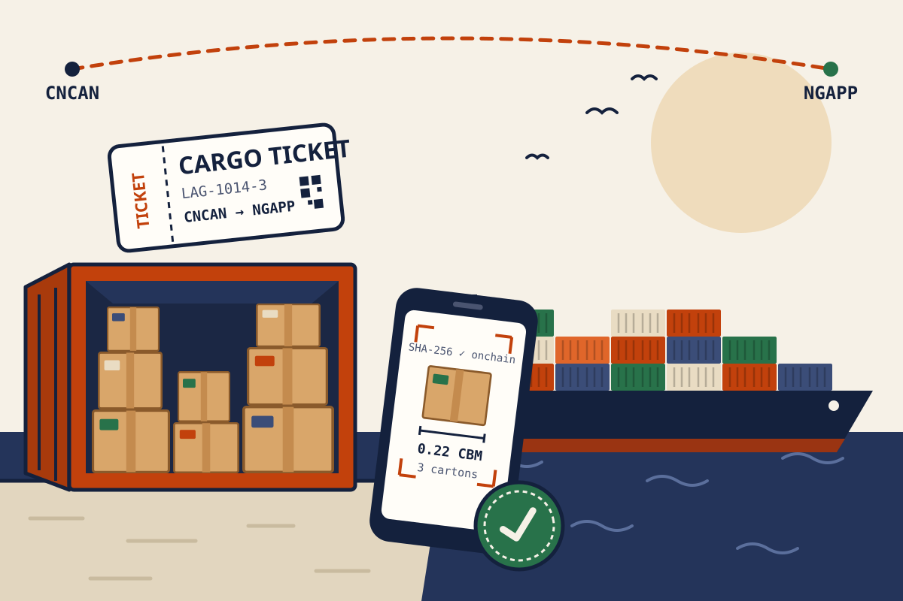
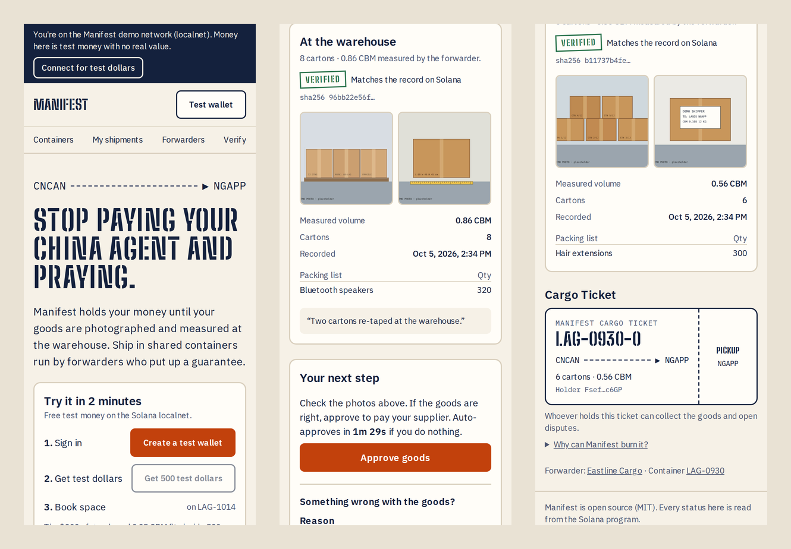
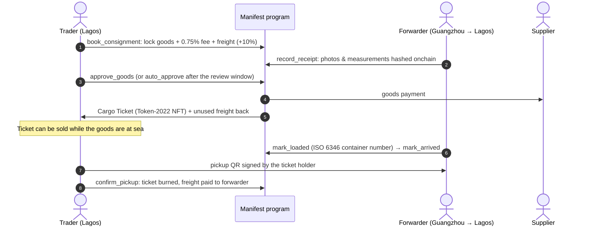
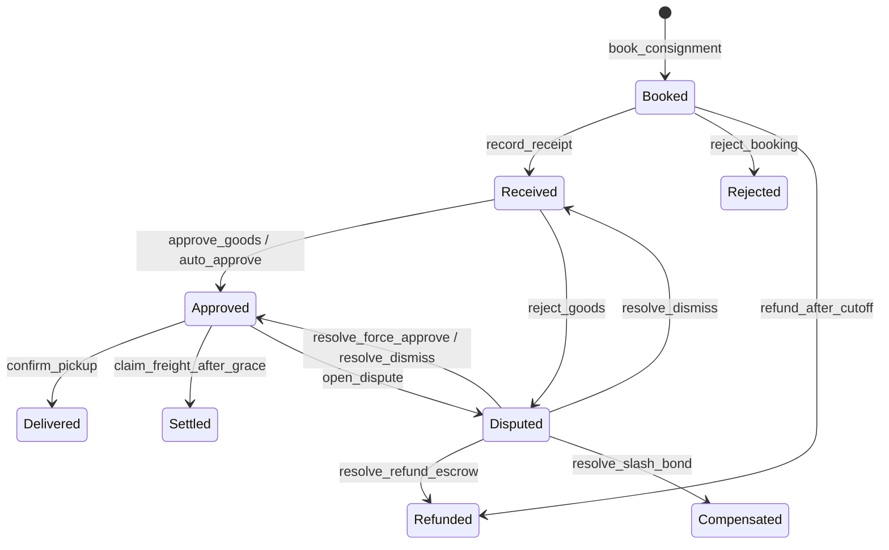
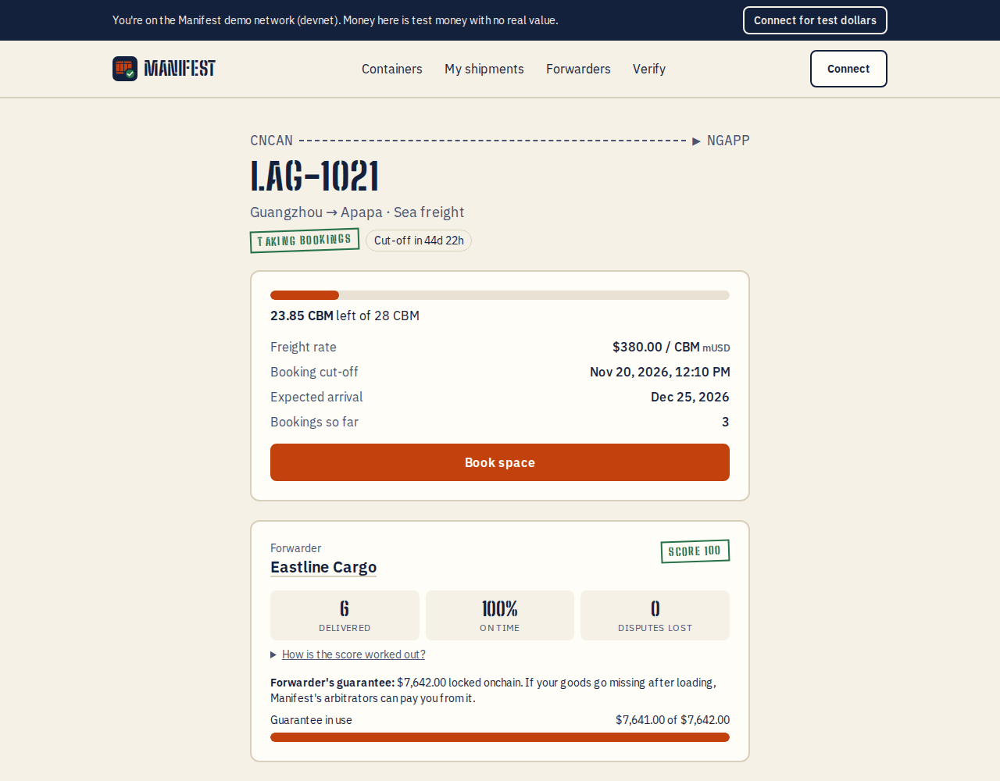
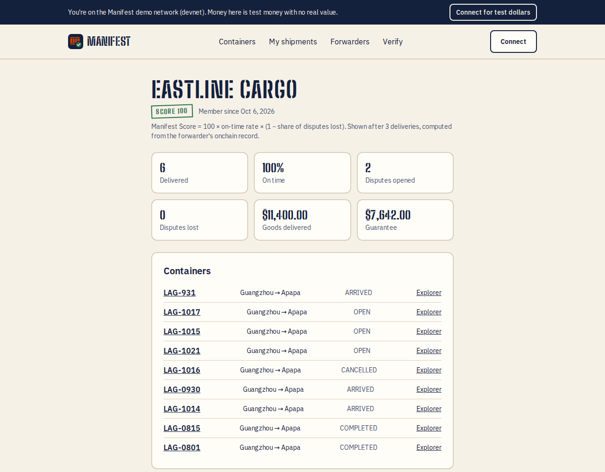
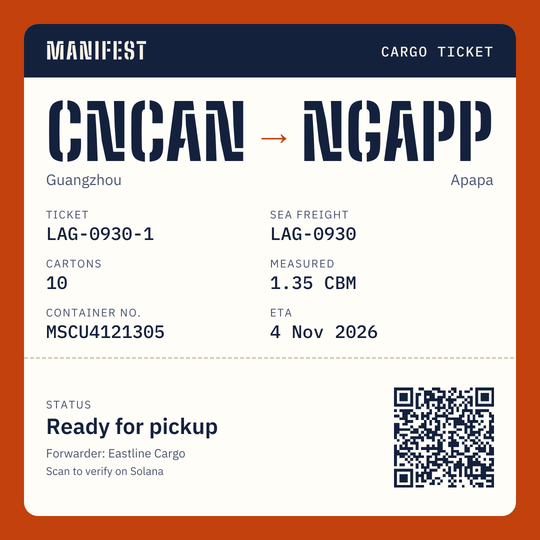
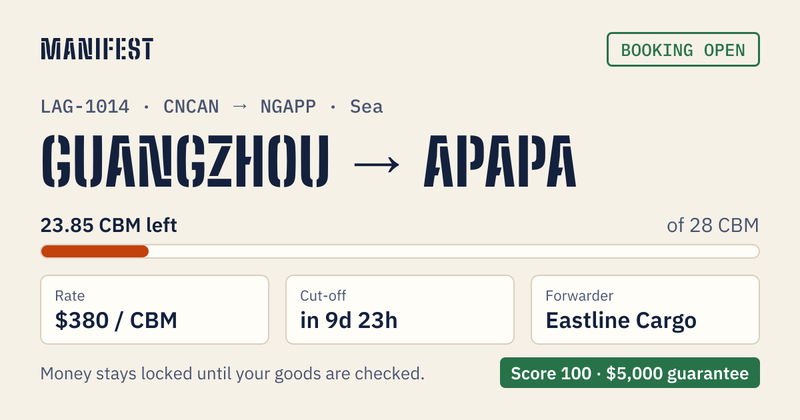
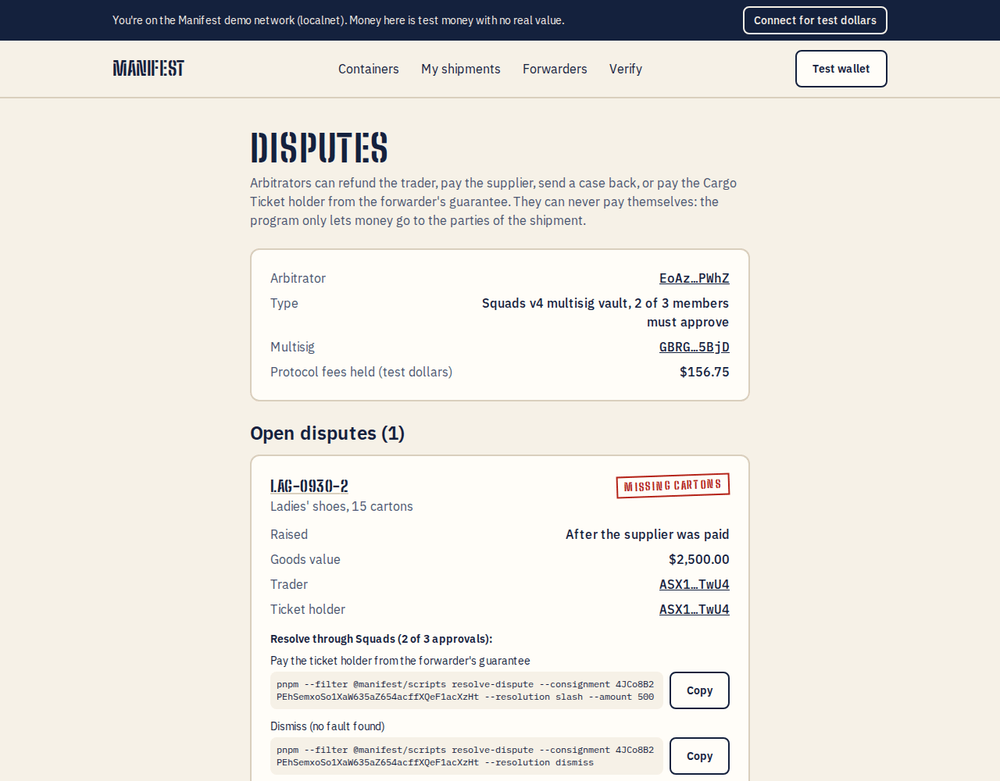
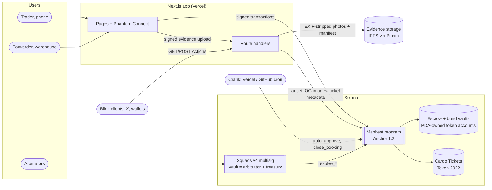

# Manifest

**Pay-on-proof escrow for traders who ship in shared containers.**

[](https://github.com/Emediong-Etuk/Manifest/actions/workflows/ci.yml)


[](LICENSE)



Manifest is a programmable letter of credit for small Nigerian importers. A trader books
space in a forwarder's shared container from China and locks the goods payment in an
onchain escrow. The supplier is paid only after the goods are photographed and measured at
the China warehouse and the trader approves. The trader then holds a transferable **Cargo
Ticket** for the goods in transit. Built for the Colosseum Crypto World's Fair Hackathon
(Solana track).

| Live demo                                                                  | Program (devnet)                                                                                               | Pitch video      | Technical demo   |
| -------------------------------------------------------------------------- | -------------------------------------------------------------------------------------------------------------- | ---------------- | ---------------- |
| [manifest-seven-tau.vercel.app](https://manifest-seven-tau.vercel.app) (1) | [`4DCv…a7S9`](https://explorer.solana.com/address/4DCvHBveVC31TztNNzJp65GeHxNNdPFVxH4vgwDwa7S9?cluster=devnet) | _link (Phase 6)_ | _link (Phase 6)_ |

(1) Devnet, with free test money: no real funds. To run everything on your machine, see
[Run locally](#run-locally).

> **Try it in 2 minutes** (devnet): open the app on your phone → **Sign in** → **Get 500
> test dollars** (free, from the demo faucet) → **Book on LAG-1021** with $300 of goods and
> 0.25 CBM → watch your shipment's timeline. Every step is a real Solana transaction.
> To take a shipment all the way to pickup, play both sides: [Try both sides](#try-both-sides-about-10-minutes).



## The problem

Chidi (an illustrative trader) sells phone accessories in Computer Village, Lagos. Twice a quarter he sends
$2,000–5,000 to an agent in Guangzhou, who pays the supplier and puts his cartons in a
shared container with forty other traders' goods. He pays before anyone has checked the
goods. Sixty days later he finds out whether he got the right phone cases, the right
quantity, or anything at all. If a carton is missing, his only recourse is a WhatsApp
argument.

Banks solve this for big importers with a **letter of credit**: the seller is paid when
documents prove the goods shipped. Nobody offers that for a trader shipping 1–3 cubic
metres in someone else's container.

- China's exports to Nigeria hit a record **$24.9 billion in 2025**, up from $18.9 billion
  in 2024 (China National Bureau of Statistics data, via
  [BusinessDay](https://businessday.ng/companies/article/china-nigeria-exports-reach-record-24-9bn-as-trade-gap-widens/)).
- China's exports to Africa reached **$225 billion in 2025**, of $348 billion total trade
  (Chinese customs data, via
  [Intelpoint](https://intelpoint.co/insights/post-pandemic-trade-reset-lifts-china-africa-exports-to-a-record-225bn-in-2025/)
  and [NTU Centre for African Studies](https://www.ntu.edu.sg/cas/news-events/news/detail/china-africa-trade-hits-record-us-348bn-as-deficit-balloons)).
- Africa faces an **annual trade finance gap of about $100 billion**, which "severely
  limits" small and medium enterprises, 80–90% of businesses on the continent
  ([Afreximbank, African Trade Report 2025](https://media.afreximbank.com/afrexim/African-Trade-Report_2025.pdf), Box 2.2).

## How it works



If something goes wrong, the trader rejects the goods at the warehouse or the ticket holder
opens a dispute after arrival. A 2-of-3 **Squads** multisig decides: refund the trader, pay
the supplier anyway, dismiss, or pay the holder from the forwarder's **guarantee** (a bond
every forwarder posts, at least 20% of the goods value they carry).



## Try both sides (about 10 minutes)

A shipment moves between two people: the **trader** (the importer, on the main site) and
the **forwarder** (the freight company, under **Forwarders**). To see the whole journey on
your own, use two accounts in Phantom (Add account) on **Solana Devnet** (Settings →
Developer settings → Testnet mode) and switch between them. No scripts or demo keys needed.

| #   | Account       | Do this in the app                                                                                                                                                                                                                                                                                                                    | Timeline        |
| --- | ------------- | ------------------------------------------------------------------------------------------------------------------------------------------------------------------------------------------------------------------------------------------------------------------------------------------------------------------------------------- | --------------- |
| 1   | A (forwarder) | **Get 500 test dollars**. **Forwarders** → company name, guarantee currency mUSD (the test dollars) → **Create forwarder account**; then **Deposit** $100 as your guarantee (it covers 20%, so up to $500 of goods). **Open a container**: any code, payment currency mUSD, cut-off tomorrow, arrival in a month → **Open container** |                 |
| 2   | B (trader)    | **Get 500 test dollars**. Open A's container from **Containers** → book $20 of goods, 0.05 CBM, **Use a test supplier address** → **Lock … and book**                                                                                                                                                                                 | Booked          |
| 3   | A             | Console → the container → the shipment → **Goods arrived at the warehouse: record receipt**: any photo, measured CBM, cartons → **Upload evidence and record receipt**                                                                                                                                                                | At warehouse    |
| 4   | B             | The photos show **VERIFIED**. **Approve goods** → **Yes, pay …** within 2 minutes (after that the crank approves for you). The supplier is paid and you hold the Cargo Ticket                                                                                                                                                         | Paid supplier   |
| 5   | A             | **Close bookings** → **Mark loaded** (container number `MSCU1234566`, any file as the bill of lading)                                                                                                                                                                                                                                 | Loaded, Sailing |
| 6   | A             | **Mark arrived at …** (the destination port)                                                                                                                                                                                                                                                                                          | Arrived         |
| 7   | B → A → B     | B: **Show pickup code**. A: **Pickup scanner** → **Paste a code instead** → **Valid ticket**. B: **I've collected my goods** → **Confirm pickup**. Freight goes to A, the ticket is burned                                                                                                                                            | Collected       |

Every click is a devnet transaction you can open on Solana Explorer from the page. Want a
dispute instead? At step 7, B opens one from the shipment page; the Squads arbitrators
resolve it (`docs/DEMO_SCRIPT.md` shows how).

## Why it's different

- **Pay on proof, not on promise.** Money moves to the supplier only after evidence of the
  actual cartons is recorded onchain and the trader approves.
- **Forwarders have skin in the game.** Every forwarder posts a slashable guarantee that
  backs the open goods value, and builds a public, unfakeable track record (Manifest Score
  = on-time rate × share of disputes not lost).
- **Goods in transit become an asset.** The Cargo Ticket is a transferable Token-2022 NFT
  that carries pickup and dispute rights, so a trader can sell goods that are still at sea.
- **Built for the shared-container leg**, where informal payment agents, bank LCs and
  Alibaba Trade Assurance don't reach. Details: [docs/COMPETITIVE_LANDSCAPE.md](docs/COMPETITIVE_LANDSCAPE.md).

## Screenshots

| Container page                                        | Forwarder console                                    |
| ----------------------------------------------------- | ---------------------------------------------------- |
|  |  |

| Cargo Ticket artwork (live from the chain)         | WhatsApp / X link preview                                        | Dispute queue (Squads)                       |
| -------------------------------------------------- | ---------------------------------------------------------------- | -------------------------------------------- |
|  |  |  |

## Architecture



**Accounts** (all PDAs of the program; layouts in `programs/manifest/src/state/`):

| Account          | Seeds                               | Holds                                                                    |
| ---------------- | ----------------------------------- | ------------------------------------------------------------------------ |
| Config           | `["config"]`                        | admin, arbitrator, treasury, allowed mints, fee / coverage bps, windows  |
| Forwarder        | `["forwarder", wallet]`             | name, guarantee balance and locked coverage, track record                |
| Bond vault       | `["bond_vault", forwarder]`         | the forwarder's guarantee (token account owned by the forwarder PDA)     |
| Container        | `["container", forwarder, index]`   | route, capacity, rate, cut-off, ETA, ISO 6346 number, B/L hash, status   |
| Consignment      | `["consignment", container, index]` | trader, supplier, amounts, volumes, evidence hash, status, ticket mint   |
| Escrow vault     | `["vault", consignment]`            | the trader's locked money (token account owned by the consignment PDA)   |
| Cargo Ticket     | `["cargo_ticket", consignment]`     | Token-2022 mint: MetadataPointer + TokenMetadata + PermanentDelegate     |
| Ticket authority | `["ticket_authority"]`              | mint authority and permanent delegate of every ticket (signs burns only) |

**Instructions** (26):

| Who            | Instructions                                                                                                                                                                                                 |
| -------------- | ------------------------------------------------------------------------------------------------------------------------------------------------------------------------------------------------------------ |
| Admin          | `initialize_config` (upgrade authority only), `update_config`, `transfer_admin`                                                                                                                              |
| Forwarder      | `register_forwarder`, `deposit_bond`, `withdraw_bond`, `open_container`, `close_booking`, `cancel_container`, `reject_booking`, `record_receipt`, `mark_loaded`, `mark_arrived`, `claim_freight_after_grace` |
| Trader/holder  | `book_consignment`, `refund_after_cutoff`, `approve_goods`, `reject_goods`, `top_up_freight`, `confirm_pickup`, `open_dispute`                                                                               |
| Anyone (crank) | `auto_approve`, `close_booking` after cut-off                                                                                                                                                                |
| Arbitrator     | `resolve_refund_escrow`, `resolve_force_approve`, `resolve_dismiss`, `resolve_slash_bond`                                                                                                                    |

More: [docs/ARCHITECTURE.md](docs/ARCHITECTURE.md) (money flow, container state machine,
compute units) and [docs/DECISIONS.md](docs/DECISIONS.md).

## Composability

- **Cargo Tickets as collateral.** A ticket is a standard Token-2022 NFT whose onchain
  status (approved, sailing, arrived) and goods value are public. A lender can finance
  goods in transit against it.
- **The forwarder record as a credit signal.** Deliveries, on-time rate, disputes lost and
  slashed amounts live in the Forwarder account; any protocol can read and underwrite them.
- **The escrow primitive.** Book → evidence hash → approve → settle works for any
  marketplace where goods are inspected by a third party before payment.
- **Open interfaces.** `@manifest/sdk` builds every instruction; the IDL ships in the SDK
  and is uploaded onchain with the deploy; Solana Actions make booking embeddable anywhere a Blink renders.

## Sponsor and ecosystem tech

| Tech                          | How Manifest uses it                                                                                                                                                                             |
| ----------------------------- | ------------------------------------------------------------------------------------------------------------------------------------------------------------------------------------------------ |
| **Phantom Connect**           | `@phantom/react-sdk`: Google / Apple sign-in (embedded wallets) when a Portal App ID is set, Phantom extension or app otherwise. The UI warns about the embedded wallets' $1,000/day limit.      |
| **Squads v4**                 | 2-of-3 multisig whose vault is the program's arbitrator and fee treasury. Resolutions are vault transactions → proposal → 2 approvals → execute (`scripts/resolve-dispute.ts`).                  |
| **Solana Actions / Blinks**   | `/actions.json` + `/api/actions/book/[container]`: book space from X or any Blink client; transaction built by the SDK and simulated before it reaches the wallet.                               |
| **Token-2022**                | Cargo Tickets: MetadataPointer → TokenMetadata in the mint, PermanentDelegate = program PDA (burn at settlement), supply 1, mint authority revoked. Unsafe extensions on payment mints rejected. |
| **Helius**                    | Planned RPC (`NEXT_PUBLIC_RPC_URL`); webhooks → Telegram notifications on the roadmap.                                                                                                           |
| **Reflect / Kora / Altitude** | Not integrated in the hackathon build: yield-bearing guarantees, gasless fees and the mainnet treasury are in [docs/ROADMAP.md](docs/ROADMAP.md).                                                |

Protocol fees (0.75% of goods value) accrue to the Squads vault, visible on `/admin`.

## Security

Self-reviewed, **not audited, devnet only**. Highlights: only program PDAs can move escrow
and guarantees; vault balance equals recorded state after every instruction; checked u128
math; arbitrators can only pay the parties of a shipment, never themselves; every program
file passed the Solana MCP `program_autofixer`. Known limits: the physical world is judged
by people (trader review, arbitrators); coverage assumes ~1:1 USD stablecoins; Phantom
embedded wallets cap spending at $1,000/day. Full threat model:
[docs/SECURITY.md](docs/SECURITY.md).

## Tests

| Suite                                 | Count | Command                            |
| ------------------------------------- | ----- | ---------------------------------- |
| Program integration (LiteSVM, Rust)   | 95    | `cargo test -p manifest-tests`     |
| Program unit (math, validation)       | 12    | `cargo test -p manifest`           |
| SDK (Vitest)                          | 32    | `pnpm --filter @manifest/sdk test` |
| Browser (Playwright, local validator) | 4     | `pnpm --filter @manifest/app e2e`  |

The browser suite runs a full two-browser trader + forwarder lifecycle, the judge path on a
360 px phone (landing → booked), a smoke test with axe WCAG 2.1 AA and overflow checks, and
a click-for-click rehearsal of the technical demo script.

## Run locally

Prerequisites (exact versions in [docs/DECISIONS.md](docs/DECISIONS.md)): Rust 1.97,
Solana CLI 4.1.2, Anchor CLI 1.2.0, Node 22, pnpm 10.28.

```bash
pnpm install
anchor build && pnpm program:test        # program + LiteSVM tests (+ IDL sync into the SDK)
pnpm -r build && pnpm -r test            # SDK, scripts, app

# Local chain with the program (and Squads cloned from devnet; see docs/DEPLOY.md)
solana-test-validator --reset \
  --upgradeable-program $(solana address -k target/deploy/manifest-keypair.json) \
  target/deploy/manifest.so $(solana address -k ~/.config/solana/manifest-dev.json)
NEXT_PUBLIC_CLUSTER=localnet pnpm --filter @manifest/scripts seed:local   # prints NEXT_PUBLIC_DEMO_MINT

# App (localnet uses a built-in test wallet; devnet uses Phantom)
NEXT_PUBLIC_CLUSTER=localnet NEXT_PUBLIC_RPC_URL=http://127.0.0.1:8899 \
NEXT_PUBLIC_DEMO_MINT=<mint> GAS_TANK_SECRET_KEY="$(cat ~/.config/solana/manifest-dev.json)" \
  pnpm --filter @manifest/app dev

NEXT_PUBLIC_CLUSTER=localnet pnpm --filter @manifest/scripts seed-demo     # the demo world
```

Devnet deploy, Squads setup, crank and Vercel: [docs/DEPLOY.md](docs/DEPLOY.md). Every
environment variable is documented in [.env.example](.env.example).

| Path                | What                                                        |
| ------------------- | ----------------------------------------------------------- |
| `programs/manifest` | Anchor program (Rust)                                       |
| `tests`             | LiteSVM program tests (Rust)                                |
| `packages/sdk`      | `@manifest/sdk`: the only place instructions are built      |
| `app`               | Next.js app + route handlers (evidence, faucet, Blinks, OG) |
| `scripts`           | Operator scripts: config, seed, crank, Squads               |
| `docs`              | Architecture, security, decisions, business, scripts        |

## Business model and roadmap

0.75% of escrowed goods value (about $750 for a container of 25 shipments averaging $4,000,
an assumption), a verified-forwarder subscription, and later in-transit inventory
financing against Cargo Tickets. Go-to-market: forwarders first, each brings 20–40
traders per container. Details: [docs/BUSINESS.md](docs/BUSINESS.md) ·
[docs/ROADMAP.md](docs/ROADMAP.md).

## Team

**Emediong Etuk Gregory (Greg)**: solo founder in Nigeria. Backend engineer (TypeScript /
Next.js, PHP / Laravel), professional illustrator and designer, West African crypto
community builder. _Links: to be added by Greg._

## License

[MIT](LICENSE) © 2026 Emediong Etuk Gregory
