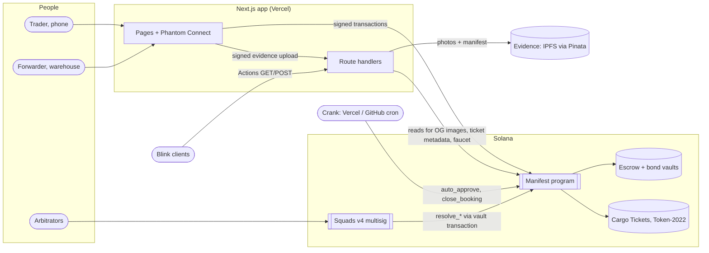
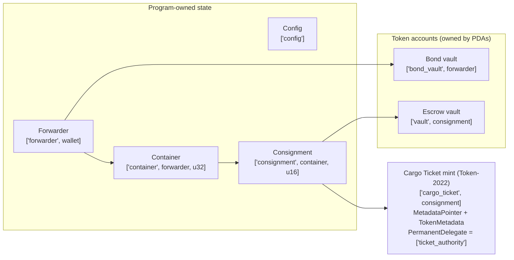
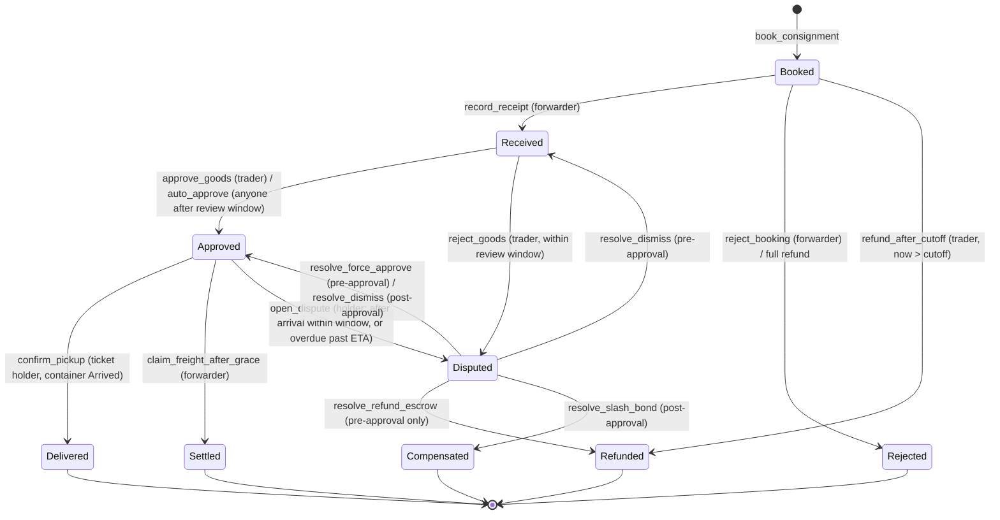
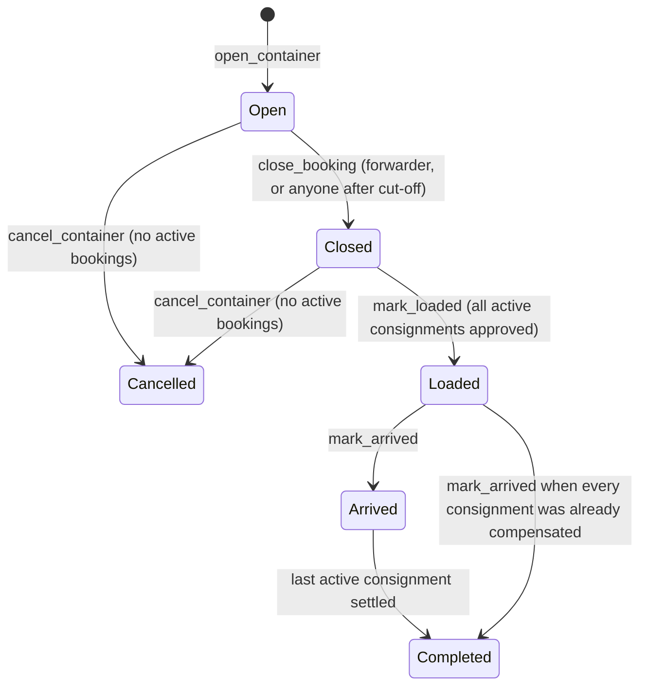

# Architecture

The whole system first, then the program in detail.

## System

| Off-chain piece               | What it does                                                                                                                  | Trust                                                                              |
| ----------------------------- | ----------------------------------------------------------------------------------------------------------------------------- | ---------------------------------------------------------------------------------- |
| `POST /api/evidence`          | Verifies the forwarder's signature, strips EXIF, stores photos + canonical manifest, returns its SHA-256 for `record_receipt` | The hash is onchain; the browser re-hashes the manifest and shows VERIFIED or not. |
| `/api/tickets/*`, `/api/og/*` | Cargo Ticket metadata + artwork and link previews, read live from the chain                                                   | Display only; never includes goods value.                                          |
| `/api/actions/book/*`         | Solana Action: builds an unsigned `book_consignment` for the requesting wallet                                                | The wallet shows and signs it; only the user's signature is required.              |
| `POST /api/faucet`            | Devnet gas tank: SOL for fees + test dollars                                                                                  | Devnet only; rate-limited.                                                         |
| `GET /api/cron/crank`         | Permissionless upkeep (`auto_approve`, `close_booking`)                                                                       | The program re-checks every condition.                                             |
| `scripts/`                    | Config, demo mint, Squads setup and dispute resolution, seed data                                                             | Operator tools; keys stay local.                                                   |

## Program at a glance

One Anchor 1.2 program, `manifest`, owns four account types and three kinds of token
accounts. Escrow and bonds sit in token accounts owned by program PDAs, so only the
program's own instructions can move them.

## Accounts

| Account          | Seeds                                      | Key fields                                                                                                                                                          |
| ---------------- | ------------------------------------------ | ------------------------------------------------------------------------------------------------------------------------------------------------------------------- |
| `Config`         | `["config"]`                               | admin, arbitrator, treasury_owner, allowed payment/bond mints, fee/coverage/buffer bps, review/pickup/dispute/overdue/on-time windows, metadata base URI, paused    |
| `Forwarder`      | `["forwarder", authority]`                 | name, bond mint + vault, bond_balance, locked_coverage, container_count, track-record stats                                                                         |
| `Container`      | `["container", forwarder, index u32 LE]`   | code, UN/LOCODE route, mode, payment mint, capacity / booked / received milli-CBM, rate, cut-off, ETA, status, ISO 6346 number, B/L hash, counters                  |
| `Consignment`    | `["consignment", container, index u16 LE]` | trader, payee, goods / fee / freight amounts, est. and measured volume, evidence hash, coverage, status (+ previous), dispute reason, Cargo Ticket mint, timestamps |
| Escrow vault     | `["vault", consignment]`                   | token account (container mint), owner = consignment PDA                                                                                                             |
| Bond vault       | `["bond_vault", forwarder]`                | token account (bond mint), owner = forwarder PDA                                                                                                                    |
| Cargo Ticket     | `["cargo_ticket", consignment]`            | Token-2022 mint, 0 decimals, supply 1, metadata in-mint                                                                                                             |
| Ticket authority | `["ticket_authority"]`                     | no data; mint/metadata authority and permanent delegate of every ticket                                                                                             |

Exact field layouts: `programs/manifest/src/state/`.

## Instructions

| Who                    | Instructions                                                                                                                                                                                                 |
| ---------------------- | ------------------------------------------------------------------------------------------------------------------------------------------------------------------------------------------------------------ |
| Admin                  | `initialize_config` (upgrade authority only), `update_config`, `transfer_admin`                                                                                                                              |
| Forwarder              | `register_forwarder`, `deposit_bond`, `withdraw_bond`, `open_container`, `close_booking`, `cancel_container`, `reject_booking`, `record_receipt`, `mark_loaded`, `mark_arrived`, `claim_freight_after_grace` |
| Trader / ticket holder | `book_consignment`, `refund_after_cutoff`, `approve_goods`, `reject_goods`, `top_up_freight`, `confirm_pickup`, `open_dispute`                                                                               |
| Anyone (crank)         | `auto_approve`, `close_booking` after cut-off                                                                                                                                                                |
| Arbitrator             | `resolve_refund_escrow`, `resolve_force_approve`, `resolve_dismiss`, `resolve_slash_bond`                                                                                                                    |

## Consignment state machine

## Container state machine

The app derives display stages ("Sailing", "Ready for pickup") from the container status
while a consignment is `Approved`; the program never iterates consignments. Container
counters (`active_count`, `approved_count`, `settled_count`) make that possible.

## Money flow

| Moment                         | From → To                                                                                                |
| ------------------------------ | -------------------------------------------------------------------------------------------------------- |
| Booking                        | trader → vault: goods + fee (0.75%) + estimated freight × 1.10                                           |
| Approval                       | vault → payee: goods · vault → treasury: fee · vault → trader: freight escrow above the measured freight |
| Top-up                         | anyone → vault: up to the freight shortfall                                                              |
| Pickup / claim                 | vault → forwarder: freight due · vault → holder: any excess                                              |
| Refund / reject / RefundEscrow | vault → trader: everything held                                                                          |
| Slash                          | bond vault → holder: min(amount, goods, bond) · vault → holder: remaining freight                        |

## Compute units (LiteSVM)

| Instruction                      | CU               |
| -------------------------------- | ---------------- |
| `book_consignment`               | ~28,500          |
| `approve_goods` / `auto_approve` | ~130,000–140,000 |
| `confirm_pickup`                 | ~38,000          |
| `claim_freight_after_grace`      | ~53,000          |
| `resolve_slash_bond`             | ~43,500          |
